# Kubernetes Overview
## Kubernetes Architecture
TBD
## Kubernetes Objects
### Pods
#### Pods Overview
Pods are the core components in Kubernetes.  When you deploy a web app, you deploy a pod.  When you deploy a Web API, you deploy a pod.  Every process you deploy in Kubernetes is deployed as a pod.  When you are scaling or replicating a process, you are scaling or replicating pods.  In other words, the pod is the unit of deployment, scaling and replication.

So what is a pod?  People new to Kubernetes tend to equate Pods with containers.  That's actually not a bad way to think about it.  In most cases, there is a single container per pod.  There are, however, good use cases for multiple containers in a single pod - more about that later.  A better way to think about pods is that they represent a cohesive unit of service that can be independently deployed, scaled and replicated.  Behind the scenes, one or more containers make up this cohesive unit of service.

Let's take a look at an example.  Suppose you wanted to deploy a web application.  To keep things simple, we will use nginx to represent our web.  The following is a pod specification for nginx.

```
apiVersion: v1
kind: Pod
metadata:
  name: nginx
spec:
  containers:
  - image: nginx
    name: nginx
    ports:
    - containerPort: 80
```

As you can see, there is one container listed, specifying the nginx docker image.  In order to deploy this pod, save the above specification to a file called nginx-pod.yaml and run the following command:

```
kubectl create -f nginx-pod.yaml

kubectl get pods
```

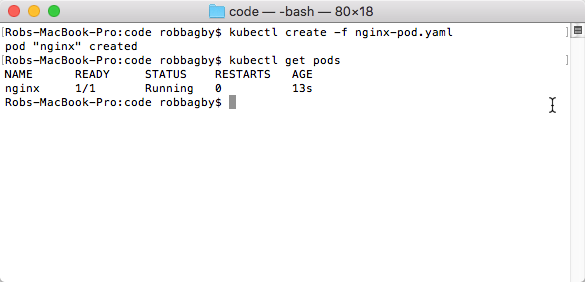

Figure X - Creating a Pod

So what did we do?  We took our pod specification and asked the Kubernetes API to create it and Kubernetes obliged.  The image above verifies that our pod is running and if I were to ssh onto the node the pod was deployed on, I would see that an nginx container is running.

So a pod has one or more containers and is the unit of deployment, scaling and replication.  Is that all you need to know?  Almost, but there is a fundamental point you should understand: pods are ephemeral - they will die.  This fact should drive your behavior in at least 2 key ways:
1) Do not create pods directly (like we did above).  If you create a pod specification directly and the pod dies, it will not be recreated.  Kubernetes has components called controllers that create pods and provide additional services such as re-deploying them when they die.  This is referred to as maintaining your desired state.  We will discuss ReplicationControllers and ReplicaSets later in this chapter.
2) Do not communicate with the pod by its private IP address.  When a pod dies and is re-deployed, it will likely have a different IP address.  We will discuss how to take advantage of Kubernetes Services to communicate with pods later in this chapter.

#### Pods, Containers and Sidecars
In the end, Kubernetes deploys containers.  As we've seen, however, Kubernetes does not interact with containers directly - it uses pods.  The pod abstraction specifies 1 or more containers.

Okay, we know that you can have more than one container in a pod.  Why would we want to?  The answer relates back to accepted software design principles such as encapsulation and single responsibility.  Each pod should have a "main" container that provides the core functionality of the pod.  In addition, the pod may have 0 or more additional containers that provide services peripheral to the main purpose of the pod.

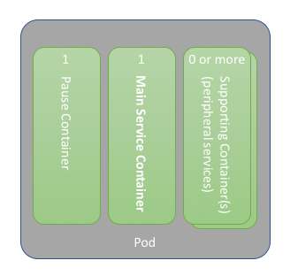

Figure X - Pods & Containers

(You may notice that there is a "Pause" container in the image above.  This is merely an implementation detail.  We will discuss it futher in the services discussion later.)

Some examples of peripheral services are logging adapters, monitoring adapters or service proxies.  This functionality is not core to service, rather they add supporting functionality.  Packaging these supporting services in their own containers allows for reuse, as well as properly encapsulates their functionality.

The next logical question is how do the containers in a pod interact.  We will discuss pod-to-pod communication in great detail later in this chapter.  For now, all you need to know is that they can communicate over localhost.  Containers in a pod can also mount and share volumes attached to the pod.

Pod specifications allow you to specify resource limits on things like CPU and memory.  All of the containers in a pod share these constrained resources.

### ReplicaSets
We mentioned earlier that if you create pods directly and the pod dies, they will not be recreated.  ReplicaSets provide this functionality.  They ensure that the configured number of replicas of a pod are running.  If a pod dies, the ReplicaSet will ensure it is recreated.  If there are too many replicas running, the ReplicaSet will terminate the offending pods.

ReplicaSets use label selectors in order to identify the pods they manage.  This provides a nice loose coupling between ReplicaSets and Pods.  Essentially, pods have labels (name-value pairs) assigned to them.  ReplicaSets manage all pods that match their label selectors.  ReplicaSet's support the new set-based selector specifications.  As such, a ReplicaSet's label selectors can be as simple as an equality selector, or a powerful set-based selector.  The figure below illustrates simple equality-based selectors.

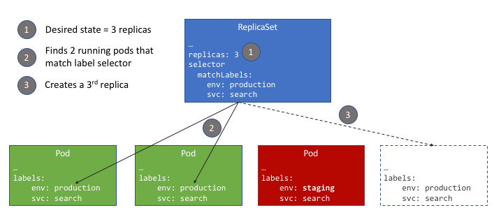

Figure X - ReplicaSets & Label Selectors

The following is an example of a ReplicaSet for our nginx web:

```
apiVersion: apps/v1
kind: ReplicaSet
metadata:
  name: nginx
spec:
  replicas: 3
  selector:
    matchLabels:
      env: production
      svc: web
  template:
    metadata:
      labels:
        env: production
        svc: web
    spec:
      containers:
      - image: nginx
        name: nginx
        ports:
        - containerPort: 80
```

You can see in the above ReplicaSet specification, the Pod template has the same schema as a pod, with the exception that there is no kind or apiVersion.  In this case, we added labels to our pod template.  These labels match the label selectors in our ReplicaSet spec.  Lastly, notice that we indicated that we want 3 replicas of pods that match our label selectors.  Let's see this ReplicaSet in action:

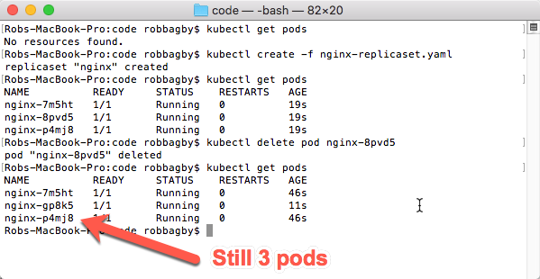

Figure X - ReplicaSet in Action

After creating the ReplicaSet, notice that 3 pods were created.  In order to illustrate the functionality of the ReplicaSet, we delete one of the pods.  You will clearly see that another pod was created.

TODO: Question: Should we detail that ReplicaSets can be HPA target

As with Pods, you will normally not create ReplicaSets directly.  As you will see in the next section, you will likely work with Deployments which will create ReplicaSets behind the scenes.

### Deployments
Deployments add rollout and rollback functionality on top of ReplicaSets.  As noted above, Deployments utilize ReplicaSets under the hood in order to implement this functionality.  When the Deployment controller detects a new deployment, it will create a new ReplicaSet whose specification matches the desired state of the new deployment.  Any existing ReplicaSets whose label selector match .spec.selector but template does not match .spec.template will be scaled down.

#### Creating a Deployment
The following is a Deployment specification that will create a ReplicaSet that manages 3 replicas of an nginx Pod, running version 1.12 of the nginx Docker Container.  The Deployment specifies label selectors that will be defined in the underlying ReplicaSet

```
apiVersion: apps/v1
kind: Deployment
metadata:
  name: nginx
spec:
  replicas: 3
  selector:
    matchLabels:
      env: production
      svc: web
  template:
    metadata:
      labels:
        env: production
        svc: web
    spec:
      containers:
      - image: nginx:1.12
        name: nginx
        ports:
        - containerPort: 80
```

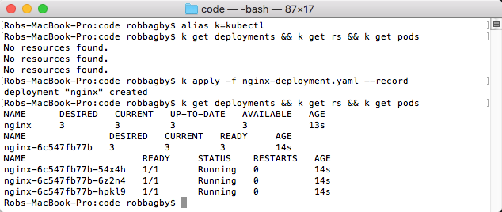

Figure X - Creating a Deployment

Looking at the image above, you will notice that a ReplicaSet was created.

#### Rolling Out a New Version
There are several ways to rollout a new version.  If you want to change the image you can use the kubectl set image command:

```
kubectl set image deployment/nginx-deployment nginx=nginx:1.13
```

You can also use the kubectl edit deployment command that will bring up the configured editor where you can make your changes:

```
kubectl edit deployment nginx
```

The preferred approach is to update the deployment specification file and call kubectl apply -f.  In the example below, I updated the deployment to use the 1.13 nginx image and saved the file as nginx-deployment.1.13.yaml:

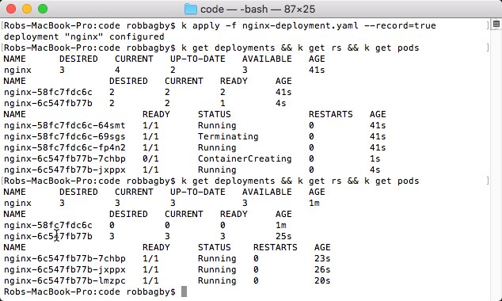

Figure X - Rolling out a New Version

#### Rolling Back to a Previous Version
To rollback a deployment, you can use the kubectl rollout undo command:

```
kubectl rollout undo deployment nginx
```

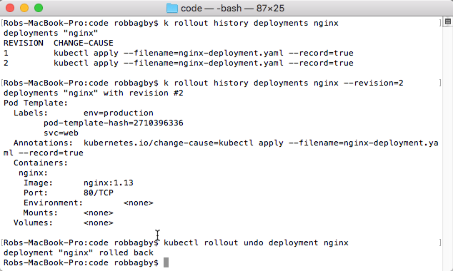

Figure X - Rolling back to a Previous Version

Looking at the image above, you will see that you can list the history of rollouts, inspect individual rollouts and undo rollouts.  I could have specified a specific version to rollback to, if required.

#### More Information
We have only touched on the basics of deployments.  You will find much more information at the official Kubernetes documentation: https://kubernetes.io/docs/concepts/workloads/controllers/deployment/.

### A Note About ReplicationControllers
You may see documentation on ReplicationControllers or examples using them.  ReplicaSets and Deployments form the replacements for ReplicationControllers.  It is recommended to use ReplicaSets and Deployments.

### Services (and Endpoints)
There are 3 core reasons why Services are necessary:
1) Pods have private IP addresses.  They are not reachable outside of the cluster.  You may want to, for example, expose a Web Site or a Web API over the internet.
2) Pods are ephemeral.  We have mentioned that several times already.  When a pod dies and a controller such as a ReplicaSet recreates the pod, the new Pod is assigned a new private IP address.  Clients should not have the responsibility of finding these changing IPs.  They need an abstraction that handles this.
3) Pods can and often are replicated.  For this reason, clients should not directly address a Pods private IP.  They should address an abstration that distributes the traffic across all replicas.

In Kubernetes, the abstraction that addresses the above concerns is a Service.  We will start with an example of a Service and graduate into more details.  Let's pretend the nginx deployment we performed is a service that a client wants to consume.  For convenience sake, we have combined the Deployment and the Service in the below code:

```
apiVersion: apps/v1
kind: Deployment
metadata:
  name: nginx
spec:
  replicas: 3
  selector:
    matchLabels:
      env: production
      svc: web
  template:
    metadata:
      labels:
        env: production
        svc: web
    spec:
      containers:
      - image: nginx:1.13
        name: nginx
        ports:
        - containerPort: 80
---
apiVersion: v1
kind: Service
metadata:
  labels:
    env: production
    svc: web
  name: nginx
spec:
  ports:
  - port: 80
    protocol: TCP
    targetPort: 80
  selector:
    env: production
    svc: web
```

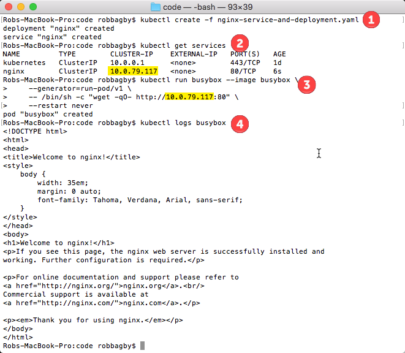

Figure X - Creating and Consuming the Service

Let's examine what we did in Figure X above:
1) Created the nginx deployment with 3 replicas and created a Service to expose the pods
2) Called kubectl get services to get the ClusterIP for the service
3) Ran a busybox image, passing a command to call our service by it's ClusterIP
4) Viewed the logs for our busybox pod to verify that we were able to reach our service

(If you are not familiar with busybox, it is an ultra small image with several utilities.  It is often used, like we did above, to run code in the cluster for development/testing purposes.)

The question you might have is "what is a ClusterIP"?  We will get to that directly.  There are 3 service types that all build upon one another: ClusterIP, NodePort and LoadBalancer.  Let's walk through each, starting with ClusterIP.

TODO: Somewhere we need to make it known that there are services of type externalname that do not use endpoints or point to pods

#### ClusterIP
The ClusterIP is a virtual private IP address for a service that is accessible only within the cluster.  A ClusterIP is assigned to every service regardless of type, as the other service types are built on top of it.  While Pod's IP addresses change, the ClusterIP will remain intact.

It is the responsibility of kube-proxy, a process running on every host, to ensure calls to the ClusterIP are routed to the appropriate Pods.  How kube-proxy ultimately accomplishes this differs depending upon the proxy-mode of kube-proxy.  We will get into that a bit more in the service-to-service networking section later in this chapter.

For now, what we need to understand is how kube-proxy knows what Pods to route to.  The answer lies with **labels**, **label selectors** and **endpoints**.  Pods have labels.  Services have label selectors.  For each Service an Endpoint object must exist containing, among other things, the private IP address for each Pod whose label(s) are consistent with the Service's label selector.  Regardless of configuration, kube-proxy uses those Endpoint objects to determine it's routing rules.

Behind the scenes, there is something called an endpoints controller.  The endpoints controller continually evaluates the label selectors for each Service and maintains an updated Endpoints collection.

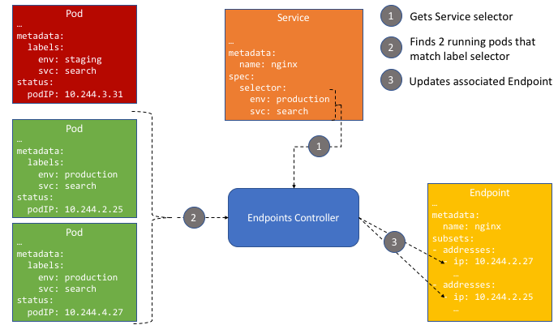

Figure X - Endpoints Controller

ClusterIP is the default service type.  If, like our example, a Service specification has no .spec.type attribute, a Service of type ClusterIP will be created.  Again, to see the ClusterIP of our nginx service, we can run kubectl get services.

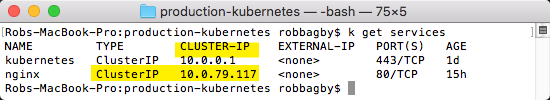

Figure X - Getting the Service ClusterIP

To see the Pods that the Service is fronting you can run the following commands (in a bash shell):

```
selectors_untrimmed=$(kubectl get service nginx --output=json | \
    jq -j '.spec.selector | to_entries | .[] | "\(.key)=\(.value),"')

selectors=${selectors_untrimmed/%?/}

kubectl get pods -o wide --selector=$selectors
```

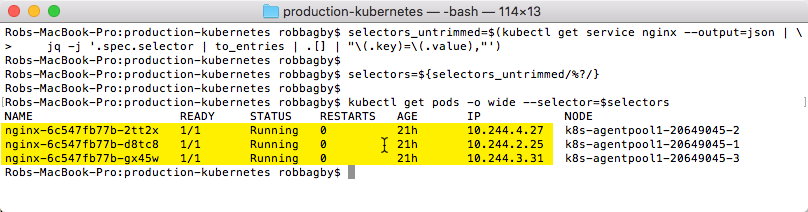

Figure X - Getting the Service Backend Pods

#### NodePort
As mentioned, Services of type NodePort are built on top of ClusterIPs.  As such, everything we described above still applies to NodePort Services.  In addition, NodePort Services expose the service on every node at a specific port: the NodePort.  Each node proxies every call to that port to the ClusterIP.

NodePort Services are accessible outside of the cluster, as long as the Node IP is reachable and the NodePort is accessible.
TODO: Expand on NodePort with an example

#### LoadBalancer
When running on cloud providers such as Azure, Google or AWS, the creation of services of type LoadBalancer will result in the creation or configuration of a load balancer and/or other components such as public IPs.  The implementation differs on each cloud.  The important thing to understand is that services of type LoadBalancer are accessible via a public IP outside of the cluster.

As an example, we will create a LB service on Azure.  We updated the service specification by adding type=LoadBalancer to the spec.

```
...
  selector:
    env: production
    svc: web
  type: LoadBalancer
```
Figure X - nginx-service-lb-and-deployment.yaml

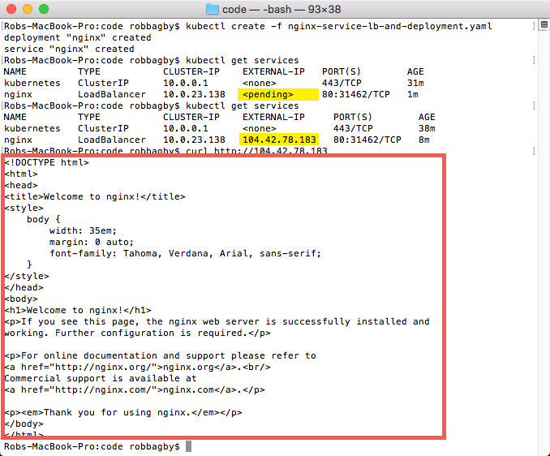

Figure X - Create and Get Services

The above figure illustrates the following 3 things:
1. Creating the service of type LoadBalancer and the deployment
2. The service is eventually updated with a Public IP
3. The service is accessible from outside of the cluster

You can see the assets that were created in Azure as a result of creating this service by looking in the resource group of your cluster.  The figure below shows the new Public IP address and LoadBalancer that were created.

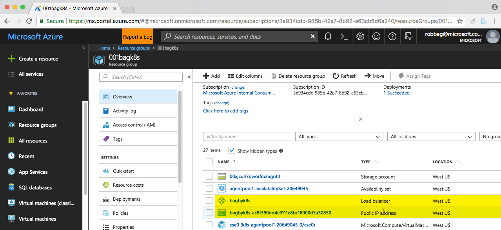

Figure X - Service in Azure Portal

TODO: Put into context.  Add a section describing what this means regarding microservices and the monolith.  Need a visual with all the stuff.
