# Overview

The clear trend we have noticed across some of the largest companies around the world is the move to a microservice architecture from a monolithic architecture. The strategy of decomposing monoliths into a series of microservices is hotly debated. Our experience is that companies are willing to make this big investment based on three reasons. First, it is difficult to scale monoliths. It is virtually impossible to take portions of the overall monolith and scale them separately. Second, monoliths are difficult to change rapidly. The time it takes to test and redeploy a monolith are significant. Changes in a monolithic application requires that the entire application be retested and redeployed. Finally, monoliths accrue technical debt over time, resulting in a breakdown in architectural integrity. You could argue that technical debt also accrues for microservice architectures, but microservices are built so that each service can be its own simple design.

Moving from a monolithic architecture to microservices with containers, using Kubernetes as the orchestrator is non-trivial.  Most companies we have worked with have found that a step by step  approach is the most effective strategy - with the logical first step being containerizing the legacy application.  Subsequent steps involve running the application in an orchestrator in a production manner (hardening security, monitoring, CI/CD, etc.) and eventually breaking the application down into microservices, often described as ‘decomposing the monolith.’

The challenges of working with a monolith are well-documented.

-	**Tight Coupling –** Interdependence.
-	**Code Difficult To Modify –** Ripple effect.
-	**Loss Of Module Specificity –** Loss of Domain model.
-	**Bigger is not Better -** Slow deploy, more regressions.
-	**Deployment Headache –** Re-deploy everything for one small change..

Here is what this chapter includes.

| Section | Goal  |
|:-------------------- |:--------------------  |
| Running the Monolith | To get you up and running to understand the monolith application that gets decomposed and run in the Kubernetes cluster.  |
| Setting up the development environment | To set up local development environment to work with the monolithic application.  |
| Setting up the MySQL Database Back-end | To set up our database backend used by the monolithic application.  |
| Run the monolith directly in the container | To begin the process of running the monolith inside of the container.  |
| Introducing Images and Containers | To introduce the topic of images and containers.  |
| Build Docker Image | To build a Docker image that encapsulates our monolithic application.  |
| Run Container | One hour monolithic application inside of a container.  |
| Test Container | To test that monolithic application running in a container  |

The goal of this chapter is to illustrate the first step in this journey: containerizing the monolith.  In later chapters we will address the guidelines for decomposing the monolith into microservices.

# Running the monolith

This is considered the starting point for your typical enterprise scenario. A typical enterprise naturally has many of line of business applications. These applications can be running on bare-metal or virtualized, on premises or in the cloud, with an almost infinite amount a variation.

This book is all about making things is concrete and realistic as possible. This means we need to think about a real live monolith that has been simplified, yet still introduces complexities, such as identity management, connecting to relational databases, and scaling - to name a few.

### Sample Application - Based on Istio's BookInfo

We have chosen to use the now iconic bookinfo microservices application (https://istio.io/docs/guides/bookinfo.html) written by the Istio team for our sample application.  Because this chapter is meant to illustrate how to containerize a monolith, we took the uncomfortable step of converting bookinfo into a monolith (too many jokes come to mind here).

##### BookInfo Sample Application

Bookinfo is a simple application that simulates an online book store.  The application encapsulates book details, reviews and ratings.  The following shows our monolith running.  Please note that the monolith does not expose ratings as separate services that can be versioned.  This will be implemented by a microservice later.

#### Source code to run monolith

This is a section about running the monolith.

| Description | Link  |
|:-------------------- |:--------------------  |
| Monolith Source Code | https://github.com/brunoterkaly/production-kubernetes/tree/master/chapters/3_ContainerizingTheMonolith/code/monolith  |

#### Understanding the source code

The purpose of the following is to run locally. These are the files you will need to do so.

You can download the code TODO: enter download location here.  The following is a high-level description of the files in the monolith:

| File | Description |
|:---|:---|
| config.ini | This file holds the configuration information for our monolith. We will decouple the monolith from the configuration settings. |
| monolith.py | This is the main Python file for our Flask application. This is the monolith that we need to de-compose into microservices later in the book. |
| mockprovider.py | This file has the in-memory implementation of our data provider. |
| dbprovider.py | This file has the MySQL implementation of our data provider. |
| Dockerfile | The Dockerfile (explored more in depth later) |
| requirements.txt | A Python requirements file that holds the dependencies to be installed |
|  \_\_init\_\_.py | A Python artifact that denotes that the directory contains packages that can imported. |
| templates | directory that contains the Flask template files |

#### What the Web Service Looks Like – The Comedy of Errors

In order to simulate the typical starting point, we will begin by running the monolith locally, uncontainerized.  You will not miss much if you skip implementing this step.  However, you should pay particular attention the how the configuration data is implemented in a config.ini file in this scenario.  The reason the configuration data is important to understand is because later we will need to remove it from the internals of the monolith so that the application could be properly run inside of a docker container.

**The Python-based Monolith In Action**

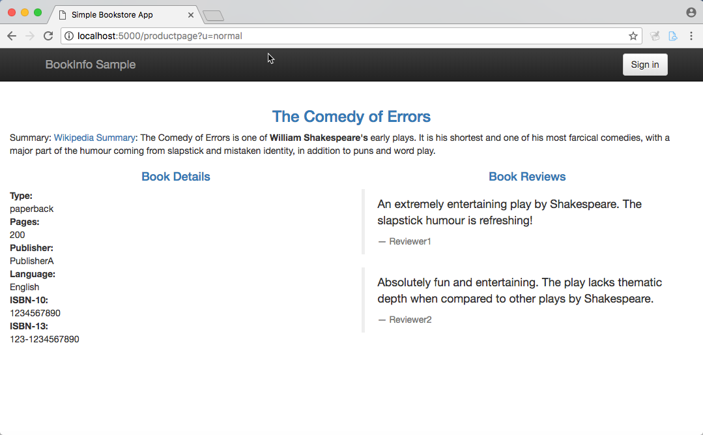

*Figure  1 -     No microservices*

# Setting up the development environment

So that the readers of this book are able to follow the examples with the real live development environment on Mac OS or Windows, this section will help you get ready to set up your development computer. We will be doing a variety of things, such as installing MySQL Workbench, installing the Python runtime, getting access to the source code for the examples, and more.

## Running the python app with Visual Studio Code

The authors are not particularly opinionated about your code editors or even the operating system of your development computer. Visual Studio Code was chosen to build our Python application because it offers a nice visual interface, not to mention a debugger.

In the next section, we will discuss setting up Python and Visual Studio Code.

## Installing Python – Along with Pip 

The first step will be to install Python. The download and installation instructions can be found here, https://www.python.org/downloads/. Ultimately, the entire Python run time along with the monolith will be placed into a container. But for now, just to get the ball rolling, we will install Python on our development computer. The monolith will run equally well across Windows, Linux, and Mac OS.

It will be important to install pip as well. For Windows, pip can be installed with the instructions here:
https://github.com/BurntSushi/nfldb/wiki/Python-&-pip-Windows-installation. Homebrew can be used for the Mac.

## Setting up the Virtual Environment

It is important to install a Python virtual environment because differing Python applications may need different versions of the same dependencies.  While this is one of the primary use cases for containers, when developing Python applications outside of containers, it is highly recommended to use Python virtual environments.  Virtual environments are self-contained directory trees with particular versions of Python installed, along with the required dependencies for the application. This capability is provided by “virtualenv,” and the following steps show you how to set it up.

As a first step, install virtualenv for your operating system.

This repo provides some guidelines.

[https://gist.github.com/Ch00k/5b4653ebf2059577002e](https://gist.github.com/Ch00k/5b4653ebf2059577002e "Configuring Virtualenv")

### Steps to Create Virtual Environment and Install Pip Dependencies

The following steps will prepare your local development to be prepared to run the monolithic application.

**Step 1 -**    cd to a directory where you want to create your virtual environment.  This directory does not need to be related to the monolith directory you downloaded. See

**Step 2 -**    Create a directory named “monolithvenv”. See Code Snippet 1.

**Step 3 -**    Create the virtual environment See Code Snippet 2.

**Step 4 -**    Cd into the new virtual environment directory See Code Snippet 3.

**Step 5 -**    Activate the virtual environment See Code Snippet 4.

**Step 6 -**    Install the dependencies for the monolith See Code Snippet 5.

**Code Snippet  1 -     Creating a directory**

	mkdir monolithvenv

**Code Snippet  2 -     Initiating the virtual environment**

	virtualenv monolithvenv

**Code Snippet  3 -     Changing directory into the virtual environment**

	cd monolithvenv

**Code Snippet  4 -     Activating the virtual environment**

	source bin/activate

**Code Snippet  5 -     Installing the PIP dependencies**

pip install flask
	pip install configparser
	pip install simplejson
	pip install requests
	pip install json2html
	pip install flask_bootstrap
	pip install mysql-connector

## Configure Visual Studio Code

Use your good judgement and preferences to choose an editor of your choice. Again, we really like Visual Studio Code and it is free. Later we can use it for editing the needed JSON files for Kubernetes. It has good highlighting and syntax checking.

**Step 1 -**    Open Visual Studio Code.  If you do not have it installed, follow the instructions here: https://code.visualstudio.com/docs/setup/setup-overview.

**Step 2 -**    You may need to, "Add Configuration," then "More."  Once you do so, you will be brought to the marketplace extensions panel, where you will need to select "Python." Once the Python Extension appears in the main pane, you can click "install."

**Step 3 -**    In VS Code, open the parent folder of the monolithvenv folder you created earlier.

**Step 4 -**    Open the launch.json file.  This is where we will update the debug configuration for our python flask application.  Click on the debug icon in VS Code.  Click on the gear icon on the top left of VS Code and choose “Python”. See Figure 2.

**Step 5 -**    Update the Flask configuration “Python: Flask (0.11.x or later)” with the following:

    {
		"name": "Python: Flask (0.11.x or later)",
		"type": "python",
		"request": "launch",
		"stopOnEntry": false,
		"pythonPath": "${workspaceRoot}/monolithvenv/bin/python",
		"module": "flask",
		"cwd": "${workspaceFolder}",
		"env": {
			"FLASK_APP": "${workspaceFolder}/monolith/monolith.py"
		},
		"args": [
			"run",
			"--no-debugger",
			"--no-reload"
		],
		"envFile": "${workspaceFolder}/monolith/.env",
		"debugOptions": [
			"RedirectOutput"
		]
	}
*JSON Code: Pointing to the monolith python code. Running virutalized python runtime*

#### Meaning of some of the JSON elements

We are editing launch.json, which is part of the Visual Studio Code configuration to run our monolith.py file.

| Json Object | Description  |
|:-------------------- |:--------------------  |
| pythonPath | Points to the virtualized Python runtime  |
| env | Points to our monolithic Python application  |
| debugOptions | Redirects output to debugger  |

#### You need align your folders in launch.json

| Item | Path | How Referenced  |
|:-------------------- |:-------------------- |:--------------------  |
| Location of monolith.py | C:\Python27\monolith | &quot;${workspaceRoot}/monolith/monolith.py&quot;  |
| Location of virtualenv | C:\Python27\monolithvenv | &quot;${workspaceRoot}/monolithvenv/Scripts/python.exe&quot;,  |

**Step 6 -**    Choose “Python: Flask (0.11.x or later)" from the debugger list and press the green debug icon

**Supporting Flask (Web) functionality**

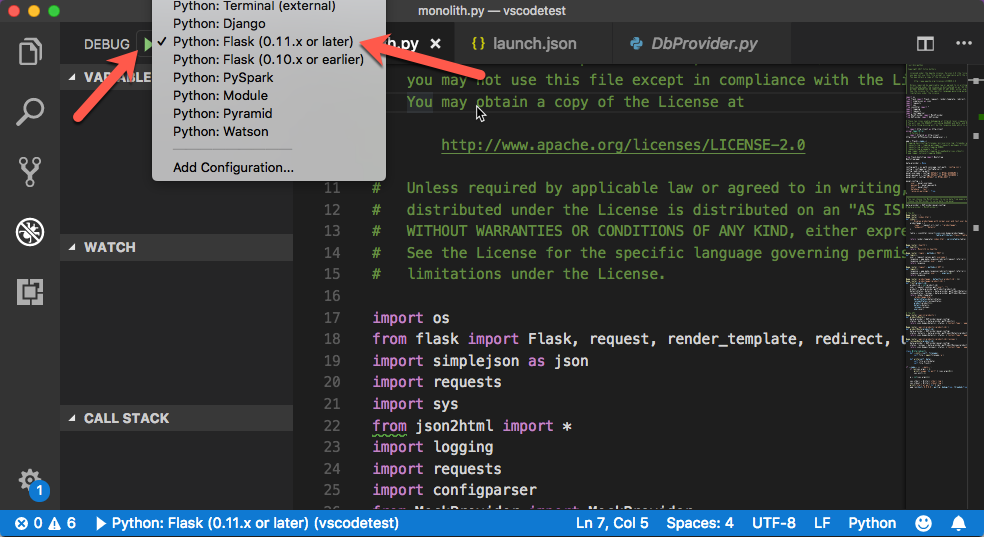

*Figure  2 -     Setting up Visual Studio Code to support Flask (Web) functionality*

**Step 7 -**    Verify that the flask application is being served and the URL is pointing to 127.0.0.1:5000. The database strings get setup but the monolith is just waiting for requests and hasn't yet tried to access the database.

**Is it running correctly? Validating the correct URL**

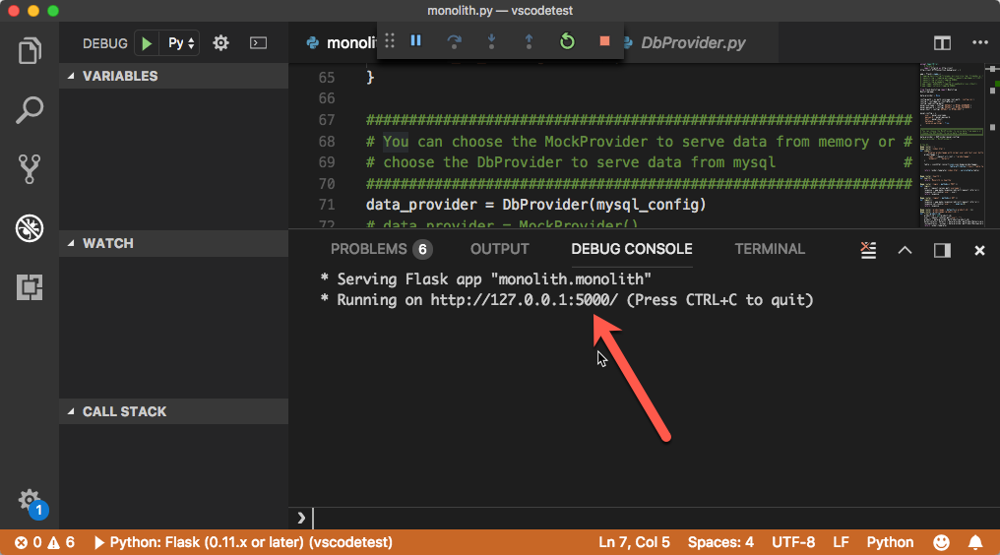

*Figure  3 -     Validating the correct URL*

**Step 8 -**    Open a browser and navigate to the URL shown in the debug console (http://127.0.0.1:5000 in my case).

You should see the running application as seen above.

# Setting up the MySQL Database Back-end

As with most monolithic applications, there is a dependency on a relational database backend. So in this section were going to show you how to create a MySQL instance that's hosted in the cloud.

###  Deploy a MySQL Instance and Deploy the Test Database

In order to test the monolith running against a MySQL instance, we (obviously) need to create the instance and deploy our test database.  There are several options you can choose, including deploying MySQL yourself into a VM or on a server, using a PaaS option or deploying a containerized version of MySQL.

###  Database as a Service

Over the past several years, we have seen the trend towards running databases as a service (DaaS).  More and more, customers want to outsource the management of the database platform.  Recently, however, we have seen customers evaluating running containerized database workloads.

###  For Development Purposes - Containerized databases are a growing trend

Containerizing the database will provide a greater degree of DevOps agility.  For example, a CI/CD pipeline could deploy a containerized database to a test cluster, run acceptance tests and tear the database down.  This, however, is in the very early stages.  The vast majority of production workloads are not containerized – yet.

###  Consuming a database service

In a later chapter, we will illustrate how to run MySQL containerized, discuss the challenges and how to address them.  For the purposes of this chapter, we will follow the emerging pattern of DaaS.  The following will illustrate how to deploy our test database in Azure Database for MySQL, Microsoft’s DaaS offering for MySQL.

##  Azure Database for MySQL -  A Managed Service

### Azure MySQL

Azure Database for MySQL is a fully managed, community edition, MySql as a Service offering on Azure.  Being community edition, this offering offers the portability required by many companies, allowing them to lift and shift between on-premise and differing clouds.  The following are instructions on deploying the monolith database to Azure Database for MySql.

####  Deploying MySQL

**Step 1 -**    Login to the Azure portal: https://portal.azure.com

**Step 2 -**    Click on “Create a resource” and enter “MySql”

**The relational database - MySQL**

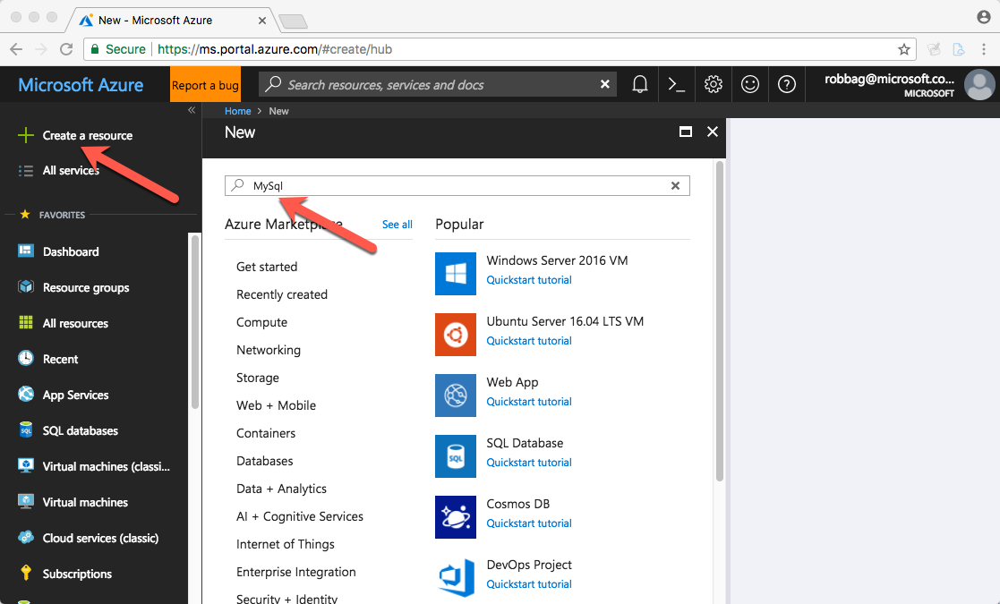

*Figure  4 -     Using the Azure Portal to set up MySQL*

**Step 3 -**    Choose “Azure Database for MySql” and click “Create”

**The relational database - MySQL**

*Figure  5 -     Setting up Azure Database MySQL*

**Step 4 -**    Enter the required information

**Entering Server Name, admin name, and password for MySQL**

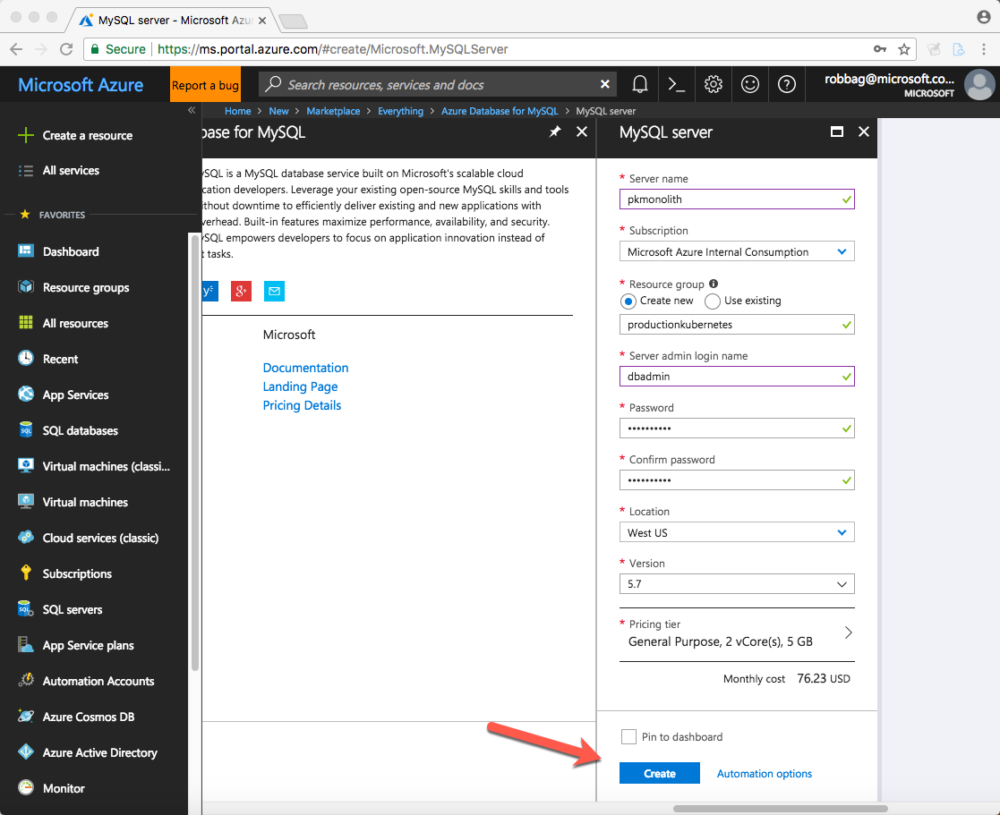

*Figure  6 -     Validating the creation of a MySQL databasex*

**Step 5 -**    Success – After a few minutes, the deployment should succeed.

**The MySQL database**

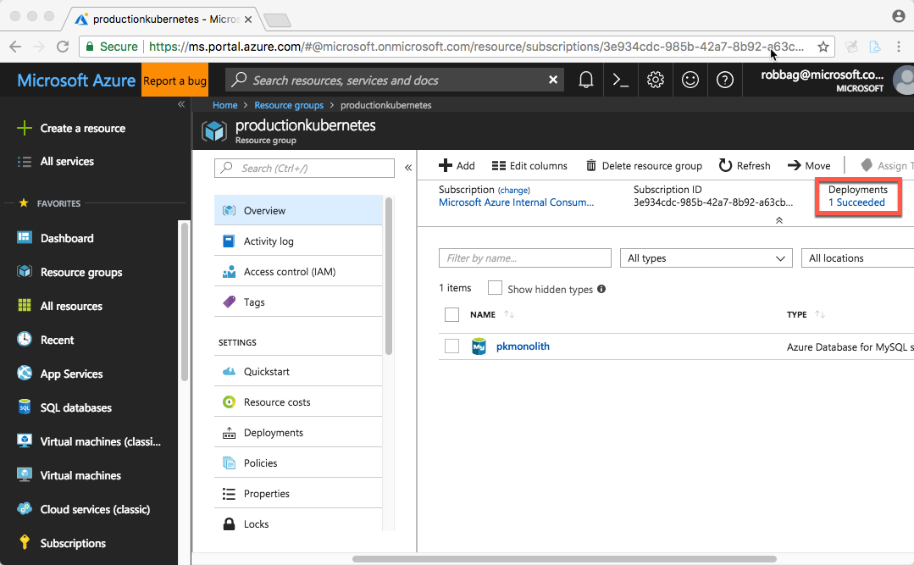

*Figure  7 -     Validating the successful deployment of the MySQL database*

###    Connecting via MySql Workbench

MySQL Workbench (https://www.mysql.com/products/workbench/) is a unified client for managing MySQL.  We will use MySQL Workbench to create our simple data model and insert some records.  The following are instructions on connecting MySQL Workbench with your Azure Database for MySQL.

**Step 1 -**    Download and install MySql Workbench - https://dev.mysql.com/downloads/workbench/5.2.html

**Step 2 -**    Click on the “+” sign to add a new MySQL connection. In the following screen, you will need to enter the hostname, username and password.

**Step 3 -**    Get the hostname and username from the Azure Portal.  Click on the link to your service.

Note below that we need to go back to the portal to retrieve our configuration and connection string information for the MySQL database hosted in Azure.

**Login Credentials**

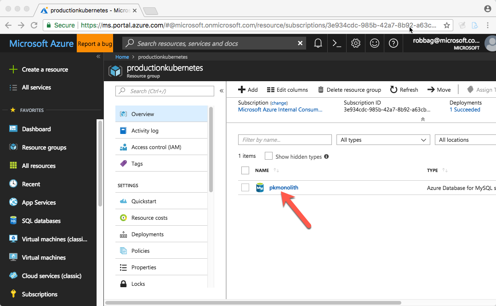

*Figure  8 -     Obtaining the server name and login name for the database*

**Step 4 -**    Copy the username and server name.  You will use these to connect to the managed MySQL instance.

**Note the Server name and the server admin login name**

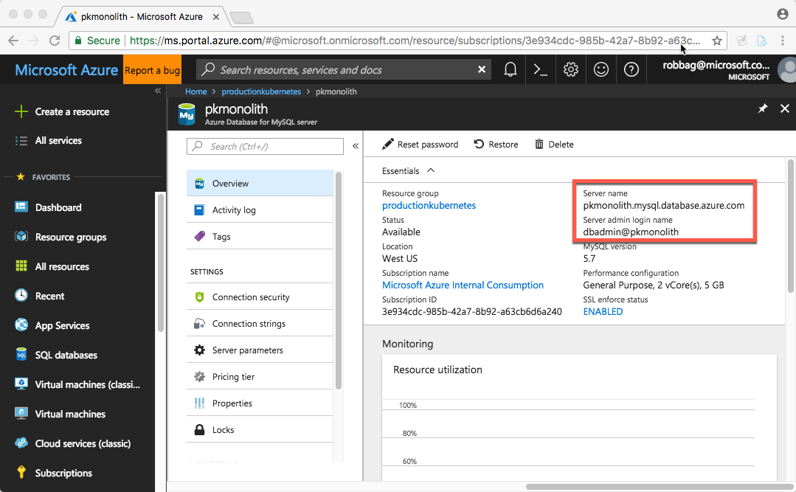

*Figure  9 -     Taking note of the server name and login name for the database*

**Step 5 -**    Return back to MySQL Workbench.

**Step 6 -**    Fill out the connection form and press “Test Connection”

**Developer Tooling for MySQL Workbench**

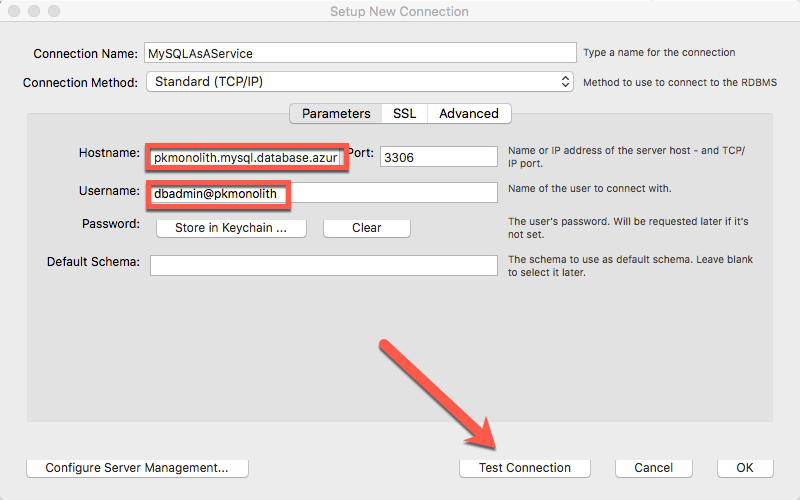

*Figure  10 -     Testing connectivity with the MySQL Workbench*

**Step 7 -**    Update the Network Security Group for the client IP Address.  When attempting to test the connection, you will be alerted that your client IP address is not allowed.  You will need to whitelist the client IP.

You can use MySQL Workbench to overcome your connection challenges. MySQL Workbench will tell you the IP address it's using to try to connect up Azure MySQL. Then it's a simple task of going to the Azure portal and white listing the client IP address so that you can connect directly to Azure MySQL.

**Punching through the firewall**

Basically, we need to whitelist our client, development computer so it can be allowed to connect into our MySQL database hosted in Azure.

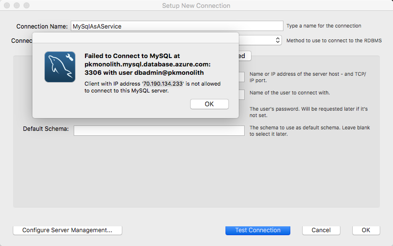

*Figure  11 -     Acknowledging failure due to unauthorized client IP address*

**Step 8 -**    Whitelist the client IP address with the service.  Click on “Connection security” and enter the client IP.

**Exposing the database**

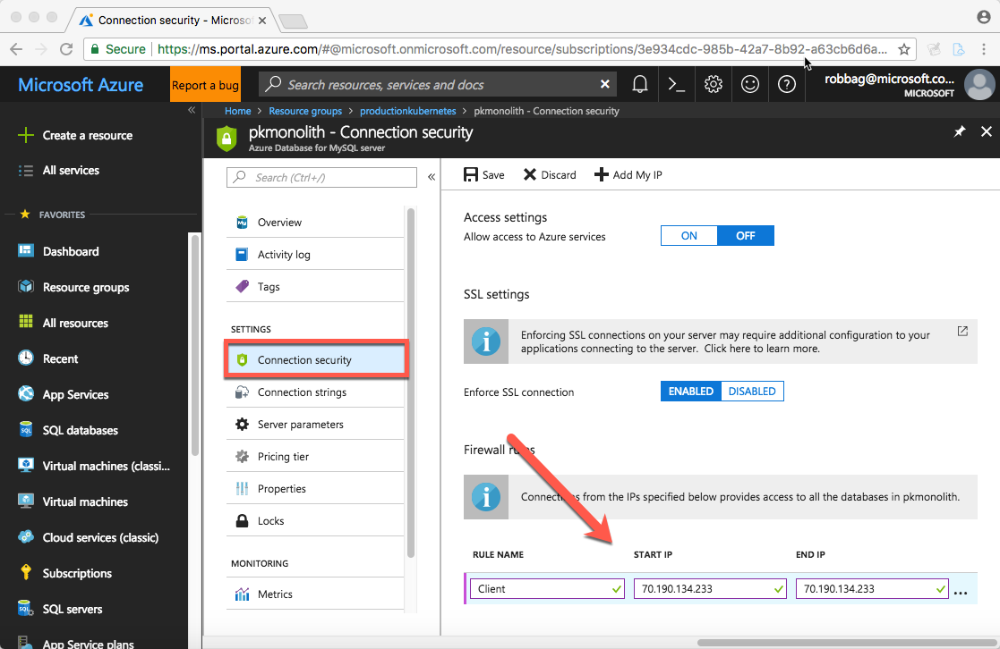

*Figure  12 -     Enabling your specific IP address to connect to the database*

**Step 9 -**    Test the connection again.  Successfully Connected!

**Test Before Continuing**

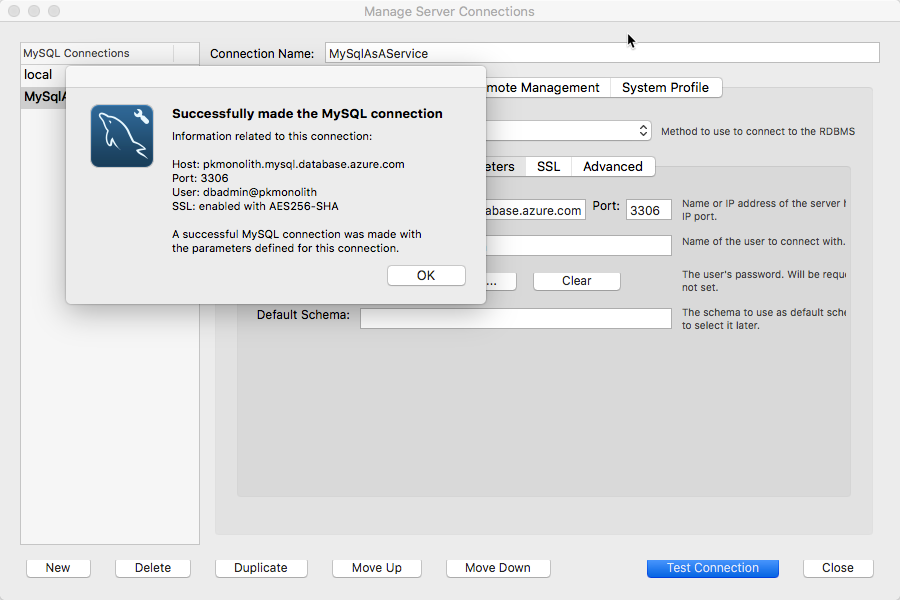

*Figure  13 -     Validating a successful connection*

#### Creating tables, adding some very basic test data.

**Step 10 -**    Deploying the sample database

1.	Open the MySQL Editor for your new connection.  Simply click on the connection in the MySQL Editor.
2.	Open mysqldb-init.sql from the monolith/mysql directory.
3.	Execute the script

**Executing mysqldb-init.sql**

TODO: add more data

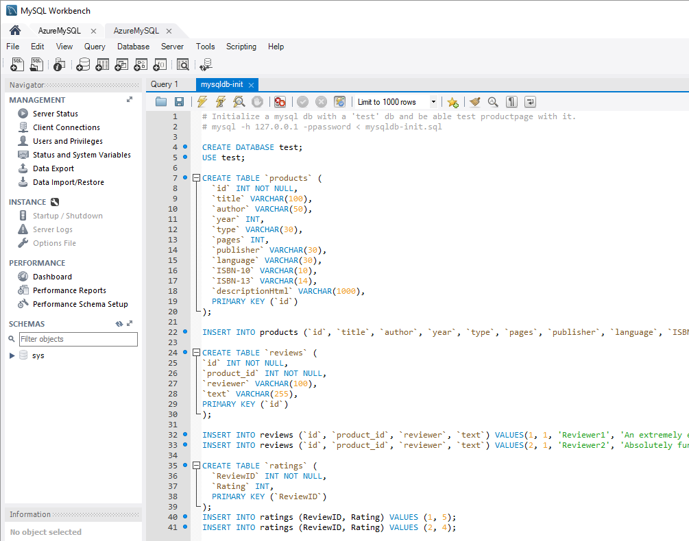

*Figure  14 -     Using MySQL Workbench to build our DB schema*

##### Successful Schema Creation

**Output from mysqldb-init.sql**

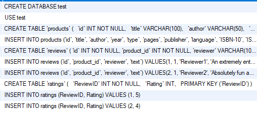

*Figure  15 -     Products, Reviews, and Ratings*

Notice the proper tables have been built and filled with some test data.

# Run the monolith directly in the container

One of the beauties of containerization is that you can just run your monolith, in most cases, without modification. So that's what we will demonstrate in this section is that we will take our monolithic application and package it up with all its dependencies into a Docker image, which we will later run. In this chapter we will run this image as a container on the local development computer. In future chapters we will run this monolithic application inside of Kubernetes. Ultimately, we will break down this monolith into a series of secure and well architected micro services.

**Step 1 -**    Use your IDE or at the command line start monolith.py. From the command line simply type “python monolith.py 5000,” where 5000 represents the port.

You can open monolith.py with Visual Studio Code and click Debug. This will kick off the Python Flask Web application that is listening on port 5000. You can set break points and trace through the logic of an http request.

**Step 2 -**    Click on the upper left DEBUG button of the Visual Studio Code IDE.

**Start the monolith with the IDE**

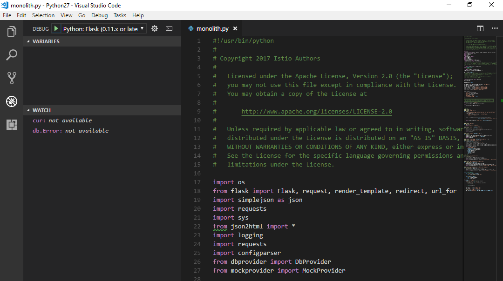

*Figure  16 -     Debugging monolith.py*

**Step 3 -**    From a Browser Navigate to the productpage using the url seen below. Notice 127.0.0.1 is the localhost. Later we access the monolith using a public IP address running in a Kubernetes cluster.

**Step 4 -**    Take note that if you were to view source in browser, you would see the magic string, “The_Comedy_of_Errors”

	# See the html source, contained in the web page below.
	The_Comedy_of_Errors

**Viewing the product page**

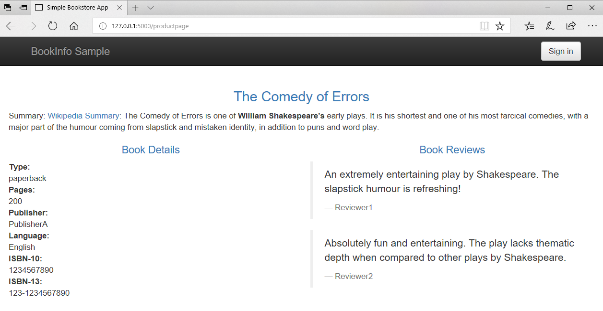

*Figure  17 -     Validating the monolith.*

### Beginning the work on the acceptance test

Because now we have a web service up and running, we can begin to think about the acceptance tests. The main goal of our acceptance test will be conducted at a very low level sanity check, looking for a specific string in the HTML response.

These Acceptance tests will validate proper operation of monolith.py. 

Once you start the monolithic application and it begins to listen on port 80, you can use a basic Python application to read the HTML response after doing an HTTP GET.

You can use the IDE if you need the debugger to start the monolith. You can also use the command line as follows:

**Code Snippet 3 -**    Run the monolith from the command line

	python monolith.py 5000

**Step 5 -**    Quit or re-use the existing running instance of the monolilth running in a container. 

You can run the following code to validate the existence of certain strings that indicate correct functioning of monolith.py. Notice in the code below we are looking for the string, “The_Comedy_of_Errors.” If that string fails to show up, we can conclude that the Acceptance Test failed. The test below is optional. Later we’ll implement this functionality with BASH. 

##### It is about halting the pipeline should any of the steps fail. In this case are talking about an acceptance test failing.

**Step 6 -**    Run the application below. Look for the file acceptance.py.

**Code Snippet  6 -     Looking for “The_Comedy_of_Errors” - acceptance.py**

    import shutil
    import urllib2

    try:
       data = ""
       url = 'http://127.0.0.1:5000/productpage'
       response = urllib2.urlopen(url)
       html = response.read()
       if html.find("The_Comedy_of_Errors") != -1:
         print "Passed Acceptance Test"
       else:
         print "Failed Acceptance Test"
    except Exception as e:
       print("Error %d: %s" % (e.args[0], e.args[1]))
    finally:
       print("completed")

This is the output from running the code above. naturally, it ran correctly because that texturing as part of the database lookup and can be found inside of the HTML response.

    Passed Acceptance Test 
    completed

 
# Introducing Images and Containers

It's at this point in the book where we pivot to a containerized view of the world, using Docker containers as the container runtime and Kubernetes as the orchestrator. Before diving into the hands-on mechanics of building and running containers, let's take a quick side trip and discuss the differences between an image and a container.

We’ve shown the monolith. At this point let’s containerize the monolith and run it first on the local development computer and later in a Kubernetes cluster.

Once we create our image, we can uploaded to a repository so that it can be downloaded and run either publicly or privately.

#### Docker Repositories

Docker Hub repositories let you share images with co-workers, customers, or the Docker community at large. If you’re building your images internally, either on your own Docker daemon, or using your own Continuous integration services, you can push them to a Docker Hub repository that you add to your Docker Hub user or organization account.

The goal of the next section is to move towards the model you see in the diagram below. The goal is to build an image called, “docker.io/productionkubernetes/monolith.” We will build it using monolith.py. We will do so using the “docker build” command.

Ultimately, we will want to run our image as  a container inside of a Kubernetes cluster.

#### Images and containers

The image below depicts the relationship between image and container. 

An image is an ordered collection of filesystem changes and the corresponding execution parameters for use within a container at runtime. Images are read-only. A container is an active and running instance of an image.

Using an object-oriented programming analogy, the difference between a Docker image and a Docker container is the same as that of the difference between a class and an object. We know that an object is the runtime instance of a class. Similarly, a container is the runtime instance of an image.

We can store an image in any repository, even the root file system of our local, development computer. We can also store the image at Docker or in the Azure Container Registry. We will explore both kinds in this book.

*Figure  19 -     Running images as containers in the cluster*

# Build Docker Image

This section is focused on building out the image which will package up the monolith Python application, along with all of its dependencies into a Docker image. If you recall we did a lot of "pip installs" in an earlier section. Those installations represent application dependencies that we need to include in the Docker image.

#### Building a Docker Image

**Docker file**

The Dockerfile contains the set of instructions used to create the image. In lieu of running a series of commands at the command line, these are packaged up in a Dockerfile. The following is the Dockerfile for our monolith (with line numbers added for clarity). You will find this file in the ‘monolith’ directory from the code download.

You can see some copy commands below. Notice that the expectation is that those files being copied are in the same folder as the Dockerfile. That includes the pip install, any necessary *.py files, as well as the templates folder.

**Code Snippet  7 -     Dockerfile**

	1   FROM python:2.7-slim
	2
	3   COPY requirements.txt ./
	4   RUN pip install --no-cache-dir -r requirements.txt
	5
	6   COPY *.py config.ini /opt/monolith/
	7   COPY templates /opt/monolith/templates
	8   EXPOSE 9080
	9   WORKDIR /opt/monolith
	10  CMD python monolith.py 9080

| Line Number | Description  |
|:-------------------- |:--------------------  |
| 1 | The FROM instruction specifies the base image.  In our case, we are using python:2.7-slim.  |
| 3 | This COPY instruction copies the requirements.txt file into the current working directory of the image.  The requirements.txt contains a list of all the dependencies required by our Python application.  |
| 4 | This RUN instruction will pass our requirements.txt file to the pip package manager to install the dependencies in our image.  |
| 6 | This COPY instruction copies all our application Python files and our config file to the /opt/monolith directory in the image.  |
| 7 | This COPY instruction copies our Flask templates into the /opt/monolith/templates directory in the image.  |
| 8 | The EXPOSE instruction indicates that our container will listen for connections on port 9080  |
| 9 | The WORKDIR instruction sets the working directory for any subsequent RUN, CMD, ENTRYPOINT, COPY or ADD instructions.  In our case, it sets the working directory for the CMD instruction in line 10.  |
| 10 | The CMD instruction is the startup command for our image.  Essentially, it allows you to determine which executable is called when a container is started from the image.  In this case it calls python, passing our application and port.  |

Note from the command above what files we are copying or adding to your monlithic.py deployed to an image./

| Filename | Purpose |
|:-------------------- |:-------------------- |
| Dockerfile | The blueprint to print the image |
| templates | Used for html output by the monolith |
| requirements.txt | Python libraries that are needed in the running container |
| monolith.py | The Python monolith |
| mockprovider.py | A mock for the database |
| dbprovider.py | The database layer for MySQL |

When we execute the "docker build" command, we end up with a Docker image. This image contains all the necessary dependencies that our monolith needs.

This includes all configuration files PIP installers, Python libraries - anything that you would like to copy into the image so that your Python applications dependencies are all present in the running container.

The following command will build the image for our monolith and name it ‘monolith’. If you have downloaded the code, open up a command prompt/terminal session and cd to the ‘monolith’ directory and run the following:

**Step 1 -**    Build the docker image with the following command

**Code Snippet  8 -     Dockerfile**

	docker build . -t brunoterkaly/monolith

The output of the docker build command.

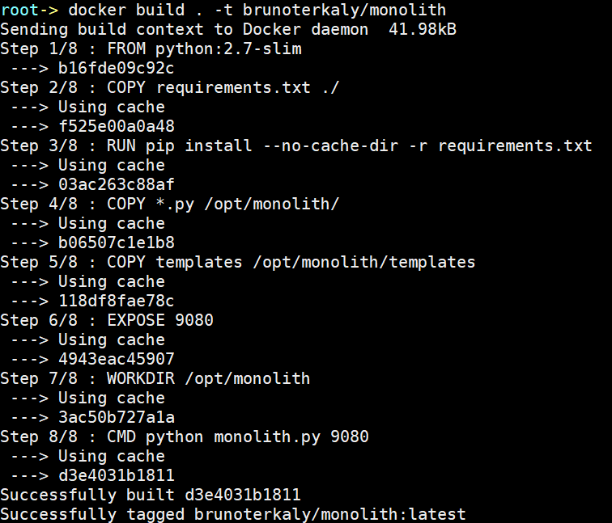

*Figure  20 -     Building the image*

**Step 2 -**    List out the local images.

Issuing the docker images command.

	docker images

**Code Snippet  9 -     Viewing the built images**

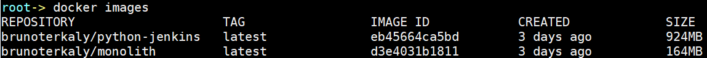

*Figure  21 -     Seeing the image on the local, development computer*

**Step 3 -**    Push the docker image to hub.docker.com

**Code Snippet  10 -     Viewing the built images**

	docker push brunoterkaly/monolith

Pushing the image to hub.docker.com

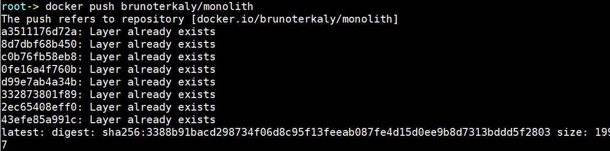

*Figure  22 -     Pushing the monolith image to docker*

**Viewing the image at hub.docker.com**

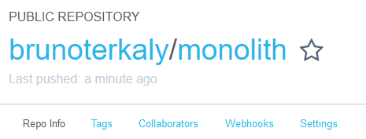

*Figure  23 -     Docker is an image repository*

Now what we ran monolith “as-is” let’s start improving the architecture.

# Run Container

Once the images built we can now begin to run the monolith inside of the container using the Docker run command. although it might seem like we just made a huge accomplishment, there is much more to do so that we can break down this monolith into a welcome post set of micro services that are secure and meet the requirements of the 10 factor model for various other best practice guidance documents.

#### Running the container locally

Before running the monolith inside of a container on a Kubernetes cluster, let's take a simpler approach and run it inside of the container on our local development computer. As with most things in software development, it makes sense to take baby steps and validate your path as you move forward.

#### The docker run command

There are a few things we need to learn so that we can run our monolith inside of the container. There is a process by which an image is created, and then run later as a container. To build the image there are a few tools we will need to learn about. The first is that docker should be installed on your development computer. Once Docker is installed, you can issue commands like "docker build."

The docker run command is used to launch an image as a container.  More specifically, it first creates a container from the image with a writeable layer and then starts the container with the specified command.  For full details on docker run, please see: https://docs.docker.com/engine/reference/commandline/run/.

**Code Snippet  11 -     The Docker Run Command**

	docker run -d --name monolith -p 9080:9080 brunoterkaly/monolith

### When the container runs so does your Python Web/Flask application.

As we saw in our Dockerfile, we have specified the default command that will be run when docker run is called against our monolith image and a command is not provided.  The command runs our Python Flask app.  The following will create a monolith container and run it with the default command:

**Step 1 -**    Issue the docker run command below

**Code Snippet  12 -     Running the monolith in a container**

	$ docker run -d --name monolith -p 9080:9080 brunoterkaly/monolith
	c93203ed6b54d41a0c8910712ae5a5a6bd70152be358cdd5bb33e544ad79a37c

**Step 2 -**    Run the docker ps command below.

	$ docker ps
	CONTAINER ID   IMAGE      COMMAND                 CREATED       STATUS       PORTS                    NAMES
	c93203ed6b54   monolith   "/bin/sh -c 'pytho..."  5 seconds ago Up 1 second  0.0.0.0:9080->9080/tcp   monolith

| Flag | Description  |
|:-------------------- |:--------------------  |
| -d | The ‘-d’ option indicates that you want to run the container in the background   |
| --name | --name assigns a name to the container |
| -p | publishes the containers port to the host.  |

More about port 9080.

| Port | Mapping  |
|:-------------------- |:--------------------  |
| Port 9080 | In this case, we are publishing port 9080 on the container to 9080 on the host.   |
| Mapping to port 9080 | Because of this, we will be able to access our Flask application on http://localhost:9080. The ‘monolith’ in our docker run is the image to run  |

### Accessing the container

With the container running and port 9080 assigned to the host, we can run our Flask application:

**Step 3 -**    Start a browser and navigate to http://localhost:9080/productpage/1.

**Code Snippet 34 – Navigate to URL**

	$ http://localhost:9080/productpage/1

**The Monolith is working in a container**

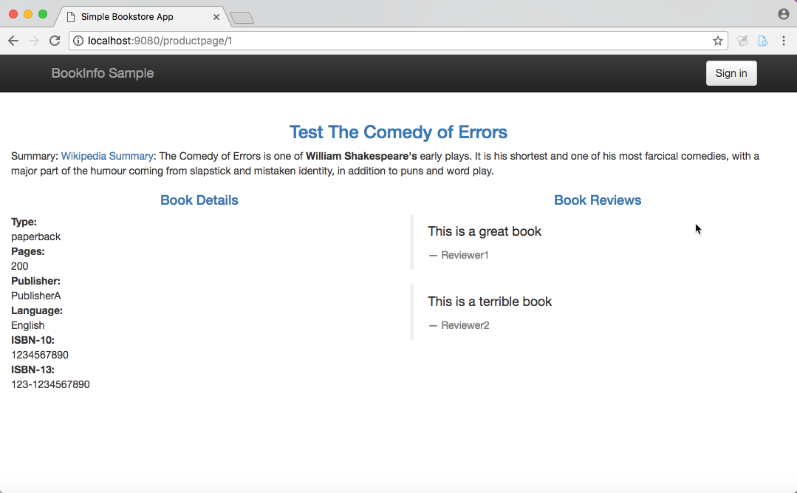

*Figure  24 -     Running the monolith in a containerized environment*

### De-couple configuration

One of the first steps when you begin the process of decomposing a monolith into micro services, is to decouple the monolith's configuration information from the monolith itself. In concrete terms this means that the Python monolith application that is running will access environment variables to get the needed connection strings to connect up to MySQL. So we will not hard-code or include the database credentials information directly in the Python code or in a application configuration file from this point forward.

### Move Config to Environment Variables

While we have our application containerized and running, there is still at least one glaring issue: the configuration strategy.  Configuration strategies like ini files work well in traditional application architectures, but do not work well for containerized applications.

Containers are supposed to be immutable, meaning they cannot be changed.  How then would you change the configuration in the ini file?  Short answer, you cannot.  Technically, you could exec into a container and make changes.  Not only is this poor practice, as we will see later, this will not work in a production hardened environment.

How then do we handle configuration?  12-factor app guidelines give us all the guidance we need (https://12factor.net/config): “The twelve-factor app stores config in environment variables”.

#### Updating monolith.py

Making the change to expose configuration data via environment variables is straightforward.  The first step is to replace the code that was reading from the config.ini with code that is reading environment variables.  In Python, we can use os.environ.  Below is the change.  (Note: This code is not production grade, as there is no validation). You could even decide to delete config.ini as the connection information will be stored in environment variables moving forward.

**Step 1 -**    Optional if you want to delete config.ini. It isn't being used moving forward.

**Code Snippet  13 -     monolith.py**

	# config_path = os.path.join(app.root_path, 'config.ini')
	# config = configparser.ConfigParser()
	# config.read(config_path)
	# inmem_or_mysql = config['DEFAULT']['INMEM_OR_MYSQL']
	# mysql_username = config['DEFAULT']['MYSQL_USERNAME']
	# mysql_password = config['DEFAULT']['MYSQL_PASSWORD']
	# mysql_host = config['DEFAULT']['MYSQL_HOST']

	# We are grabbing from environment variables.
	inmem_or_mysql = os.environ['INMEM_OR_MYSQL']
	mysql_username = os.environ['MYSQL_USERNAME']
	mysql_password = os.environ['MYSQL_PASSWORD']
	mysql_host = os.environ['MYSQL_HOST']

#### Important Point

| Storing Credentials | Description | 
|:-------------------- |:-------------------- | 
| Secrets | In a future chapter we will store the secrets such as the MySQL password in a more productionized manner. |

**Step 2 -**    Run docker build again and be sure takes advantage of the config.ini file that we just edited.

**Code Snippet  14 -     Rebuild the monolith image and push again**

	docker build -t brunoterkaly/monolith .
	docker push brunoterkaly/monolith

####   Updated docker run

The last step is to modify our docker run statement to pass the environment variables.  The following illustrates this change:

**Step 3 -**    Run the container

**Code Snippet  15 -     Code to run the container and accept traffic on port 9080**

	docker run -d --name monolith -p 9080:9080 \
	-e MYSQL_HOST=pk-monolith.mysql.database.azure.com \
	-e MYSQL_USERNAME=sqladmin@pk-monolith \
	-e MYSQL_PASSWORD=P@ssw0rd \
	-e INMEM_OR_MYSQL=INMEM \
     brunoterkaly/monolith

In order for the command above to run properly you may need to open up port 9080.

# Test Container

In this final section we will validate that the monolith behaves appropriately when run inside of the container on our local development computer. This is in fact the productivity boost for many development teams because it is easy for the monolith to run reliably anywhere it's needed, particularly on the developer's main computer.

### Test the application

**Step 1 -**    Use the browser and test the container works as expected.

You can open a new browser and navigate to http://localhost:9080/productpage and you should see the application.

	http://localhost:9080/productpage

# Summary

The purpose of this chapter was to introduce the monolith, briefly discuss why they are a challenge to deal with, and start going down the path of containerized monolithic application. We got into some details of how you might want to decouple the application configuration information monolithic application, which simplifies the movement containers a and later to cluster orchestration.

We address the details of how the doctor build process works. We included some example Docker commands to view images and push them up to a repository.

Once we were able to run the container we showed how you might connect up to it, and further how you might start thinking about creating some acceptance test for your Jenkins-based that DevOps pipeline.

As this book moves forward we will start looking that the monolith running inside of the container and think about how we might start to decompose it into separate micro services. We will architect these micro services to run in the Kubernetes cluster. 

And as you read deeper into this book will start to explore that there is more work to be done when architecting micro services to run on Kubernetes. There is much more than meets the eye regarding security, encryption, specialized routing rules, deployment scenarios, and much more.

