# Kubernetes Networking

If you think about one of the breakthroughs that Kubernetes brings to the world is the networking piece.


We have found that understanding networking is a core aspect of being able to successfully migrate applications to the cloud. The creators of Kubernetes have done a wonderful job of solving difficult routing problems in distributed networking architectures. Kubernetes uses the Container Network Interface, a networking stack for Linux containers.

There are 4 areas of Kubernetes networking to discuss: 

1. container-to-container
2. pod-to-pod
3. service-to-pod 
4. external-to-pod.  


## Container-to-container
We have described that pods encapsulate 1 or more containers and discussed some use cases.  The goal here is to discuss and illustrate how that works and how the containers can communicate with one another from a networking perspective.

The most straightforward way to illustrate how pods are constructed and how they communicate is with a Docker example.  Keep in mind that Kubernetes supports other runtimes like rkt that have slight variations.  That said, it is easiest to illustrate intra-pod communication with Docker.

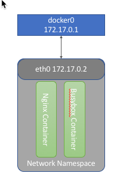

Figure X - Simulating Pods with Docker

The above figure illustrates how pods work using docker constructs.  Both containers share the same network namespace and the 172.17.0.2 IP address.  Because they are sharing the same IP, the containers cannot share the same port.  Let's see how this works.

Run the following commands:
``` sh
docker run --name nginx -d nginx
docker run --name client --net=container:nginx -d busybox \
    bin/sh -c "wget -qO- http://localhost:80; sleep 1500"
docker logs client
```

You should see something similar to the following:
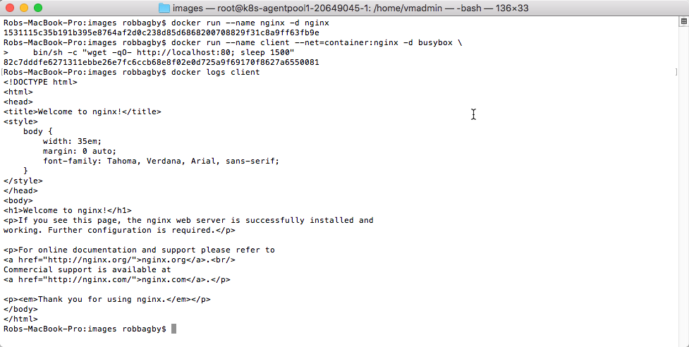

Figure X - Creating a Pod with Docker

The following are some important things to point out from the above example:
* The first docker run creates a container called nginx from the nginx image
  * The nginx container exposes port 80
  * This container does **not** map port 80 from the container to the host.  In other words, you cannot reach nginx from the host.
  * What you don't see:
    * Docker created a virtual bridge called docker0.  That bridge is allocated a block of IPs
    * When this container was created:
      * A network namespace was created
      * A virtual ethernet device is created and connected to docker0
      * The virtual device is mapped to appear as eth0 in the container
      * The eth0 interface is given the 172.17.0.2 IP adress from the bridge's block
* The second docker run creates a container called client from the busybox image
  * --net=container:nginx is passed to the docker run.  This tells Docker to put the container in the network namespace of the nginx container.
  * The command "wget -qO- http://localhost:80; sleep 1500" is run on the container.  This command runs a query on localhost, port 80 and then sleeps (so the container will stay running).  This clearly illusrates that containers in the same network namespace can communicate with each other over localhost.
* The docker logs command illustrates that the client container was able to connect to the nginx container over localhost

A good way to illustrate that the client container is sharing the network namespace is to run the following:
``` sh
docker ps
docker inspect nginx | grep NetworkMode
docker inspect client | grep NetworkMode
```

On my machine you see the following - which clearly illustrates that the client container joined the networking namespace of the nginx container:
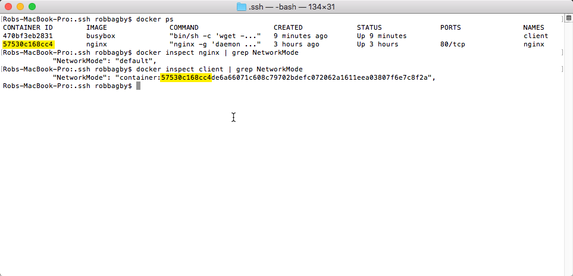

Figure X - Network Mode of Containers

Let's run a few more commands to dig a bit deeper.
``` sh
docker network ls
# There should be a network named bridge in the returned list
docker network inspect bridge \
    --format='{{index .Options "com.docker.network.bridge.name"}}'
# Returns the name of the bridge network: docker0
docker network inspect bridge --format='{{range .IPAM.Config}}{{.Gateway}}{{end}}'
# In my case, returned 172.17.0.1 - The IP address for the docker0 bridge
docker inspect nginx \
    --format='{{.NetworkSettings.Networks.bridge.IPAddress}}'
# Returns the IP address for my "Pod".  In my case: 172.17.0.2
```

On my machine, running the above commands looks like this:
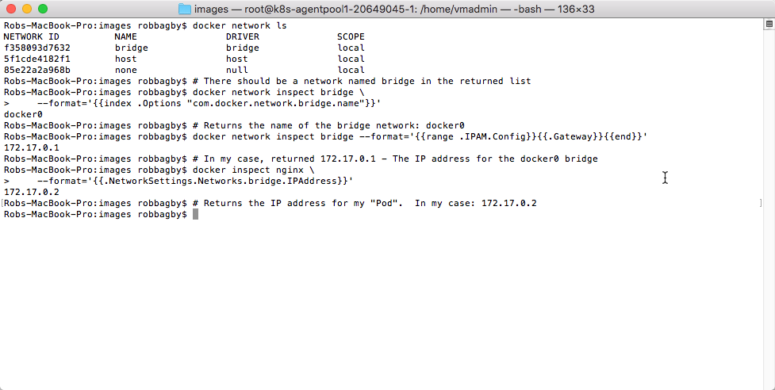

Figure X - Digging Deeper into the Sample Docker Pod

There is one remaining point to make with regards to Kubernetes Pods, when using Docker.  When Kubenetes creates a Pod, it creates a pause container.  The role of this container is **only** to create the network namespace and reserve the IP.  All of the containers in that pod will be created in the namespace of the pause container.

It should now be clear how Pods are constructed and how containers within the same pod can communitate.  If we extend the example and run the following command, you will see that through this example, containers are able to communicate to other containers on the same host:
``` sh
docker run --name client1 -d busybox \
    bin/sh -c "wget -qO- http://172.17.0.2:80"
```

Communicating to pods/containers on the same host is clearly not enough.  The next section on pod-to-pod communication will address this.

## Pod-to-pod
Kubernetes assumes that every pod can communicate with every other pod in the cluster, regardless of host.  The pods are reachable by IP address.  This is an important design decision in that it simplifies porting VM workloads to Kubernetes.  So how is this implemented?  

Kubernetes uses a network plug-in architecture.  This means that there are a variety of providers that can provide networking services to Kubernetes.  The providers simply have to adhere to Kubernetes constraints.  According to the Kubernetes documentation (https://kubernetes.io/docs/concepts/cluster-administration/networking/): 
"Kubernetes imposes the following fundamental requirements on any networking implementation (barring any intentional network segmentation policies):
* all containers can communicate with all other containers without NAT
* all nodes can communicate with all containers (and vice-versa) without NAT
* the IP that a container sees itself as is the same IP that others see it as"

(Note: As we learned in the previous section, Kubernetes uses the IP-per-pod model, so the constraints actually apply to pods.)

The plugin model Kubernetes supports is CNI - the Container Networking Interface.  There are a variety of plugins available, each with their own pros and cons.  The goal here is not to compare/contrast the implementations, rather to illustrate pod-to-pod networking.  To that end, we will use the azure-vnet plugin as our example.

### Configuring a cluster with azure-vnet plugin
In order to provide a working example, we created a cluster in Microsoft Azure using acs-engine (see Appendix X).  As you can see below, I set the networkPolicy to azure.  Azure-vnet is the default in acs-engine, so I could have also left out the kubernetesConfig altogether.  Not shown, I configured the cluster to have 1 master and 2 agents - agent0 and agent1.

```
    ...
    "orchestratorProfile": {
        "orchestratorType": "Kubernetes",
        "orchestratorRelease": "1.9",
        "kubernetesConfig": {
            "networkPolicy": "azure"
        }
    },
    ...
```

The resulting cluster configured azure-vnet as the network plugin.  We can verify this by sshing onto the master and inspecting the kubelet configuration and looking in the cni plugin directory:
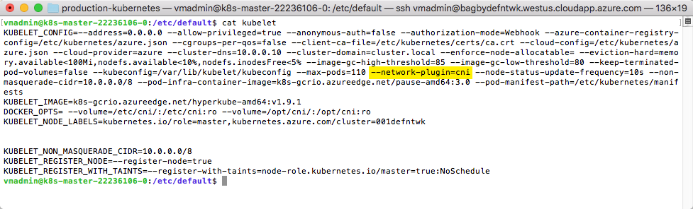

Figure X - kubelet configuation - Illustrating cni is configured

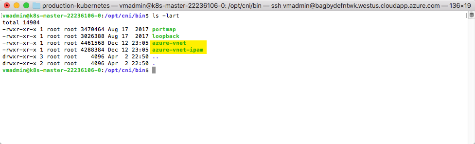

Figure X - azure-vnet in the cni plugin directory

### Explaining pod-to-pod via azure-vnet CNI plugin
The azure-vnet plug-in takes advantage of native Azure networking.  It connects all pods and nodes to a flat Azure subnet.  Let's see how this works.

In our cluster, a virtual network (VNet) was created.  Looking in the Azure portal, we can see that the VNet has a single subnet with an address range of 10.240.00/12.
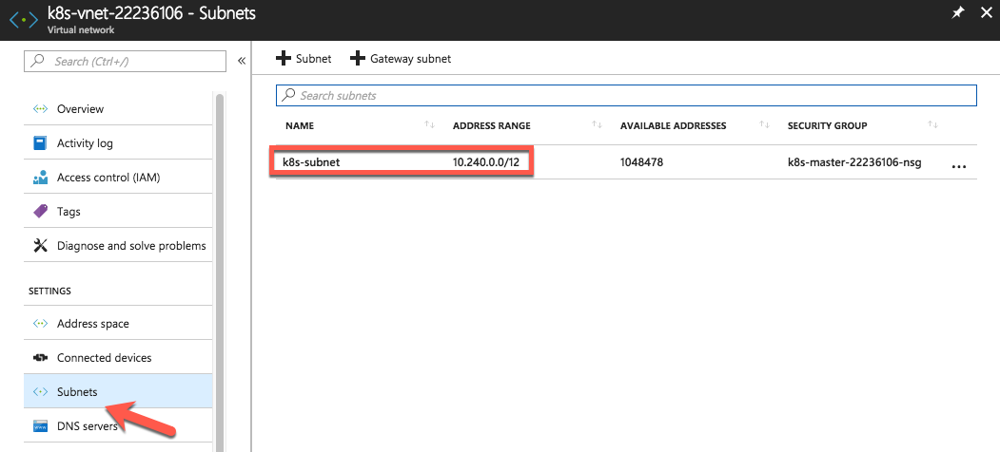 

Figure X - Azure VNet

In Azure, Virtual Machines communicate with other resources in a VNet via Network Interfaces (NICs).  Each of the nodes in our cluster has a NIC assigned to it.  The following snapshots show the NICs assigned to the agent nodes.  Notice that their IPs fall in the subnet range.
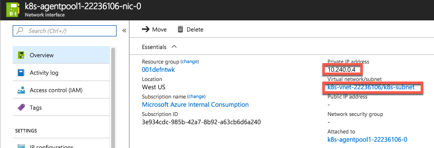 


Figure X - Nics for each agent

Network Interfaces in Azure allow you to add additional IP addresses that can be assigned to additional resources (such as Pods).  When using the azure-vnet plugin, additional IP Addresses are pre-allocated to each of the agent NICs.  These will be assigned to Pods as they are deployed.  The following is a snapshot of the IP Configurations of the Nic for agent0.  Again, notice that the IP addresses again fall in our subnet.
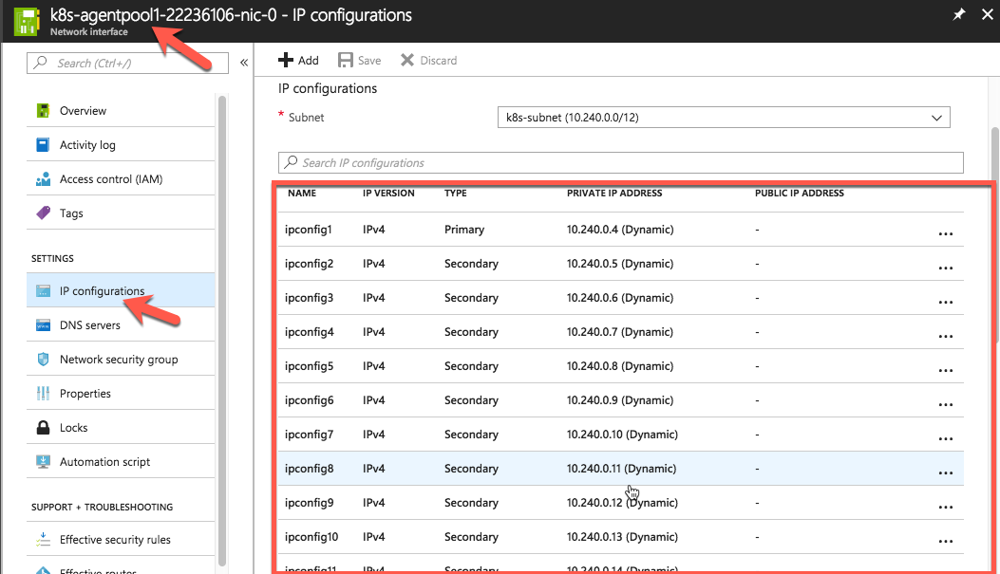 

Figure X - IP Configurations for Agent0 Nic

In order to illustrate the pods getting assigned these IPs, I have to deploy a few.  I deployed 9 nginx instances by running the following:
``` sh
kubectl run nginx --image=nginx
kubectl run nginx1 --image=nginx
...
kubectl get pods -o wide
```

Here is what the output of the get command looks like:
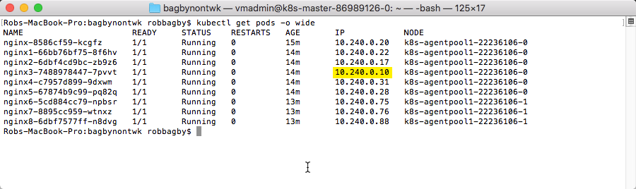

Figure X - All running pods with their IP addresses

Each of the IP addresses were assigned from the pool of pre-allocated IPs added to the NICs.  We highlighted one of the IPs that is visible in the earlier screenshot of IPs added to the first agent.  All of the IPs, in fact, come from the pool pre-allocated to the NICs.

If you remember back to our Simulating Pods with Docker architecture (Figure X), here is what the updated architecure looks like that enables pod-to-pod communication:

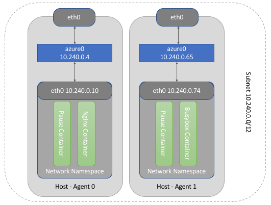

Figure X - pod-to-pod architecture

### Illustrating pod-to-pod communication
Now we will implement the actual example shown in the above figure.  We ran the following command a few times until the busybox container was deployed to agent1.  As you can see, we passed a wget command to the IP address of one of our nginx containers running on the agent0.

``` sh
kubectl run busybox --image=busybox -- \
    /bin/sh -c "wget -qO- http://10.240.0.10:80; sleep 1500"
kubectl get pods -o wide
```

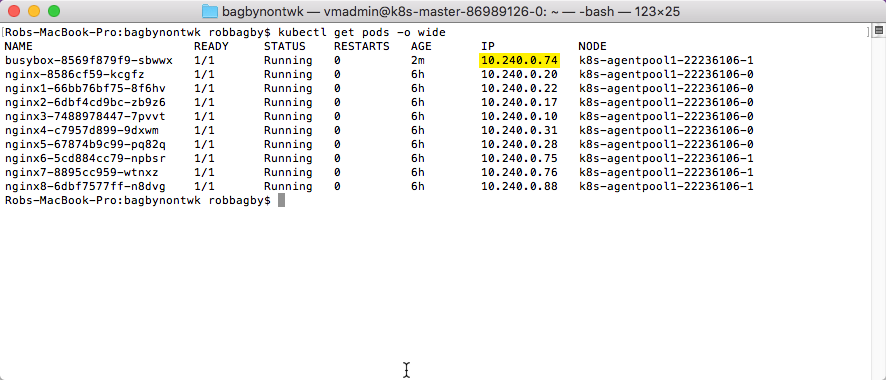

Figure X - New list of running pods with their IP addresses

Below you can see that the busybox image running on the agent1 was able to connect to the nginx container running on agent0 via it's IP address.

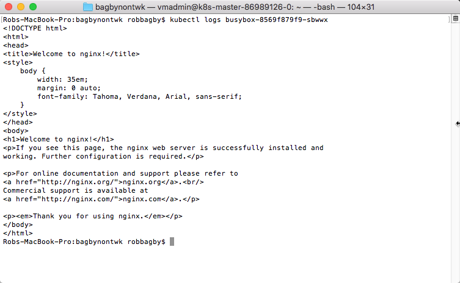

Figure X - Successfully reached pod on other host

### How IPs are assigned
While not important to understanding pod-to-pod networking, we'll close the loop and briefly describe how the IPs are assigned.  If you ssh into an agent node (Refer to this post to see how to ssh into agent nodes: https://stackoverflow.com/questions/44621763/how-do-i-ssh-to-nodes-in-acs-kubernetes-cluster) and run ifconfig, you will see, in addition to the docker0 bridge, a new bridge network called azure0.  This bridge has the azure-vnet-ipam provider configured for IP management.  That plugin is responsible for assigning IP addresses from Azure to the newly created Pods.

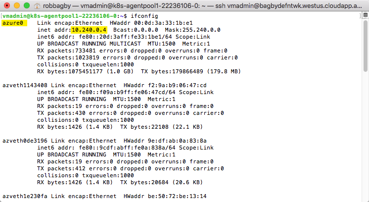

Figure X - ifconfig on agent0

## Service-to-Pod
Services are the abstraction in Kubernetes that allow one to access pods via a static IP address.  Understanding how Service-to-Pod communication works is a bit confusing for a few reasons:
1) There are a variety of implementations of Service-to-Pod communication which work differently.  
2) "Services" aren't really a thing.  They are more of a working concept, implemented by several players including kube-proxy, Endpoints and parts of the Linux kernel's subsystem.  

In this section, we will briefly describe the 3 implementations (aka proxy-modes): userspace, ipTables and IPVs.  We will then use the iptables implementation to illustrate how service-to-pod communication works.  It is important to note that the actual implementations differ across clouds and will likely change.  The goal here is to broadly illustrate the approach.

### Proxy-modes
At the time of writing of this book, kube-proxy has 3 proxy:modes:

#### Proxy-mode: userspace
Userspace was the original and only implementation of kube-proxy until Kubernetes version 1.1.  In this mode, iptable rules are maintained that forward to kube-proxy.  Kube-proxy, a go application, terminates the connection and opens a new connection to one of the pods behind the service.  It forwards requests to the pod and responses to the caller.

The benefit of userspace mode is that, because there is an actual proxy, if a backend pod does not respond, the proxy can retry another pod.  The challenge with userspace mode is that kube-proxy runs in userspace.  This means that an expensive copy is required when moving from kernelspace to userspace and another copy operation moving back to kernelspace.  

#### Proxy-mode: iptables
Proxy-mode was introduced in Kubernetes 1.1 and is the default mode.  As it's name would imply, this mode uses only iptables entries to redirect traffic to the backend pods.  Kube-proxy does not act as an actual proxy in this implementation.  It's responsibility is to watch for the addition and removal of Services and Endpoints and maintain an updated set of iptables rules. 

If you are not familiar with iptables rules, or how this might work, we will illustrate an iptables implementation in the next section.  For now, all you need to know is:
1) kube-proxy is not an actual proxy in this implementation
2) iptables rules redirect calls to the service's clusterIP to a backend pod
3) kube-proxy watches for the addition and removal of Services and maintains the iptables rules that forward calls to the clusterIP/port to a new iptable chain
4) kube-proxy watches for the addition and removal of Endpoints and maintains the iptables rules which forward to the actual pod IP

There are two other important points to make: 1) Because there is no actual proxy, retry's are not possible.  2) iptables mode is more performant than userspace mode because no move to userspace is required.

#### Proxy-mode: ipvs
As of Kubernetes 1.9, Ipvs is in beta.  The implementation is logically similar to iptables, however uses ipvs rules to do the redirection.  Kube-proxy plays a similar role, watching for changes to Services and Endpoints and ensuring the ipvs rules are up to date.  The important thing to understand is that ipvs use a more efficient data structure than iptables and are thus more performant.

### Proxy-mode:iptables deep-dive
In this deep dive, we will follow a real example of a ClusterIP service fronting 3 pod instances.  The goal is to illustrate how iptables rules, maintained by kube-proxy, route calls to the service to the backend pods. 

If you are interested in re-creating the example, it is running in a Kubernetes 1.9 cluster running Calico.  Again, the exact implementation is not important.  The goal is to illustrate, in general, how the iptables mode works.  

We deployed the example with the following command:

TODO: add the full git url to the yaml below
```
kubectl create -f nginx-service-and-deployment.yaml
```

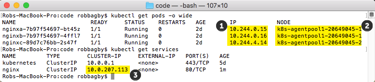

Figure X - Demo Pods and Service

| Node                      | Node IP    |
|---|---|
| k8s-agentpool1-20649045-0 | 10.240.0.6 |
| k8s-agentpool1-20649045-1 | 10.240.0.5 |
| k8s-agentpool1-20649045-2 | 10.240.0.4 |
Table X - Node IP Addresses

The previous figure and table show the following information which we will be using in our illustration:
1) The IP Addresses of the Pods
2) The Nodes the Pods were deployed on
3) The ClusterIP of the service
4) The IP Addresses of the Nodes (The table)

The following is a high-level view of the example deployment and service, with the IP Addresses:

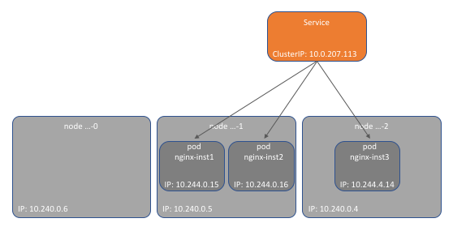

Figure X - High Level Overview of Service and Pods

Next, let's list the iptables rules on one of the worker nodes.  In order to do this, we sshed onto node 2.  (Refer to this post to see how to ssh into agent nodes: https://stackoverflow.com/questions/44621763/how-do-i-ssh-to-nodes-in-acs-kubernetes-cluster)  Once sshed into that node, running as admin, we ran the following command to list the relevant ip table rules:

```
iptables-save | grep nginx
```

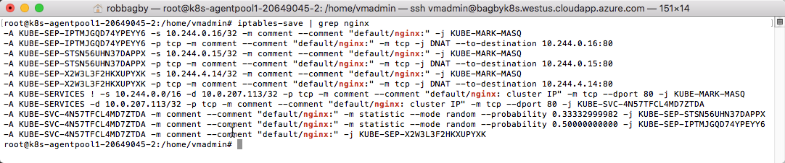

Figure X - List the iptables rules

In order to clarify what these rules are doing, we created the following diagram:

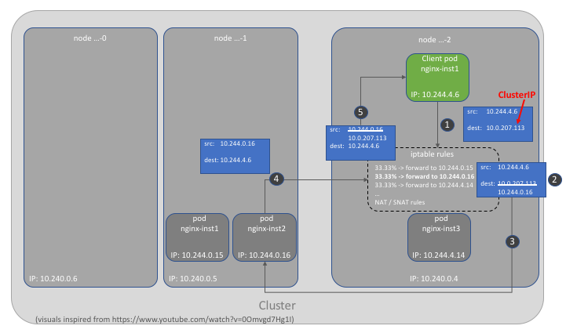

Figure X - Service-to-Pod Logical Architecture

Let's describe what is happening here:
1) The client (a pod running in the cluster) makes a request to the Service's ClusterIP: 10.0.207.113
2) iptables rules forwards any call with a destination of the ClusterIP to one of the 3 pods randomly.  There are actually 3 sets of rules that accomplish this:
    * This rule says that a packet with a destination (-d) of our custer IP (10.0.207.113) and protocol (-p) tcp and destination port (80) should jump (-j) to chain KUBE-SVC-4N57TFCL4MD7ZTDA
      ```
      -A KUBE-SERVICES -d 10.0.207.113/32 -p tcp -m comment --comment "default/nginx: cluster IP" -m tcp --dport 80 -j KUBE-SVC-4N57TFCL4MD7ZTDA
      ```
    * Chain KUBE-SVC-4N57TFCL4MD7ZTDA uses the iptables-extension (-m) statistics to randomly (--mode random) jump (-j) to one of 3 chains: KUBE-SEP-STSN56UHN37DAPPX, KUBE-SEP-IPTMJGQD74YPEYY6 or KUBE-SEP-X2W3L3F2HKXUPYXK.  Each chain is for a specific pod.  Note that each jump has a 33.33% probability.  If the first rule is not hit (33.33% chance), the second rule has a 50% chance - which is a 33.33% overall chance (50% of the remaining 66.66% chance).
      ```
      -A KUBE-SVC-4N57TFCL4MD7ZTDA -m comment --comment "default/nginx:" -m statistic --mode random --probability 0.33332999982 -j KUBE-SEP-STSN56UHN37DAPPX
      -A KUBE-SVC-4N57TFCL4MD7ZTDA -m comment --comment "default/nginx:" -m statistic --mode random --probability 0.50000000000 -j KUBE-SEP-IPTMJGQD74YPEYY6
      -A KUBE-SVC-4N57TFCL4MD7ZTDA -m comment --comment "default/nginx:" -j KUBE-SEP-X2W3L3F2HKXUPYXK
      ```
    * DNAT to the destination (--to-destination) of the pod IP/port (10.244.0.16:80).  We only show one of the three chains here.  The first rule marks the packet for masquerading, meaning that the source IP will be appropriately rewritten.  
      ```
      -A KUBE-SEP-IPTMJGQD74YPEYY6 -s 10.244.0.16/32 -m comment --comment "default/nginx:" -j KUBE-MARK-MASQ
      -A KUBE-SEP-IPTMJGQD74YPEYY6 -p tcp -m comment --comment "default/nginx:" -m tcp -j DNAT --to-destination 10.244.0.16:80
      ```
3) The call is forwarded to the appropriate pod IP and Port
4) The pod sends the response to the client
5) iptables rules rewrite the source from the pod's IP Address to the original destination id, the ClusterIP and the response reaches the client.  The rewrite is accomplished by a connection tracking feature of the linux kernel subsystem that remembers the original source and destination.  When destinations are DNATed like in step 2, this feature will performa a rewrite, making the response look like it came from the original  destination.  

It is not necessary to fully understand the ins and outs of iptables.  Hopefully, the above example does give you a good, high-level understanding of how ClusterIP services work under the hood.

## External-to-pod
In the service-to-pod section, we detailed how Services work, specifically Services of type ClusterIP.  Remember that ClusterIP services are only reachable within the cluster.  As we discussed in the Kubernetes Overview chapter, Services of type NodePort or LoadBalancer can be used to expose services to external clients.  In this section, we will extend the iptables deep-dive example to Services of type LoadBalancer.

(Aside: Ingress Controllers can be, and often are, used to expose pods externally.  Chapter X is dedicated to ingress controllers.)

To extend our example, we edited the ClusterIP service and changed the type from ClusterIP to LoadBalancer.  In order to edit the service, we ran the following command, changed the service type and saved the change:

TODO: add the full git url to the yaml below
```
kubectl edit service nginx
```

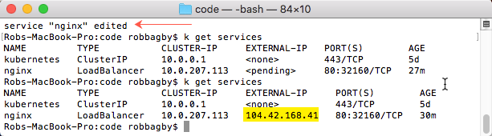

Figure X - Update the Service Type to LoadBalancer

Once the service type is updated, let's take another look at the iptables rules:

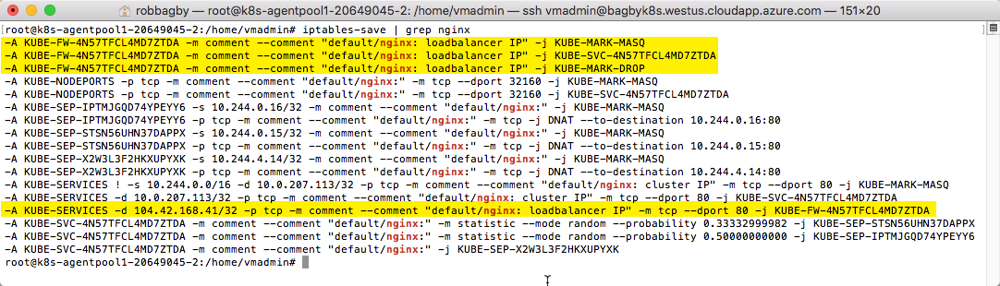

Figure X - Updated iptables Rules

There are 6 new rules, 4 of which are highlighted above.  The remaining 2 are NodePort rules which are not important to this discussion.  We again have  a logical architecture to help clarify what is happening:

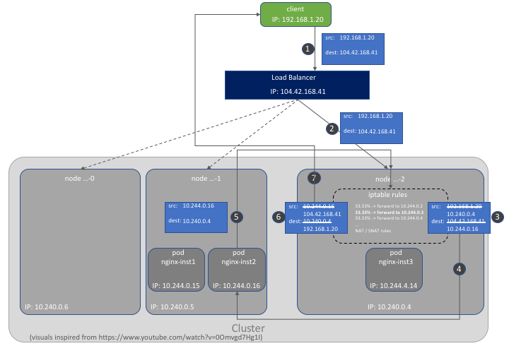

Figure X - External-to-Pod Logical Architecture

Let's describe what is happening here:
1) The client running outside makes a request to the Service's External IP: 104.42.168.41.  This is an Azure Public IP address that is registered with an Azure LoadBalancer.  The LoadBalancer is configured to forward traffic destined for this Public IP to the worker nodes in our cluster.
2) The LoadBalancer chooses Node 2 to forward this request.
3) iptables rules forwards the call with a destination of the external IP to one of the 3 pods randomly.  There are actually 4 sets of rules that accomplish this:
    * This rule says that a packet with a destination (-d) of our external IP (104.42.168.41) and protocol (-p) tcp and destination port (80) should jump (-j) to chain KUBE-FW-4N57TFCL4MD7ZTDA
      ```
      -A KUBE-SERVICES -d 104.42.168.41/32 -p tcp -m comment --comment "default/nginx: loadbalancer IP" -m tcp --dport 80 -j KUBE-FW-4N57TFCL4MD7ZTDA
      ```
    * This chain performs 2 logical operations: 1) It jumps to a rule (-j KUBE-MARK-MASQ) that marks the packet, indicating to linux to un-NAT the packets that are returned from the pod and 2) it jumps (-j) to the KUBE-SVC-4N57TFCL4MD7ZTDA chain.
      ```
      -A KUBE-FW-4N57TFCL4MD7ZTDA -m comment --comment "default/nginx: loadbalancer IP" -j KUBE-MARK-MASQ
      -A KUBE-FW-4N57TFCL4MD7ZTDA -m comment --comment "default/nginx: loadbalancer IP" -j KUBE-SVC-4N57TFCL4MD7ZTDA
      -A KUBE-FW-4N57TFCL4MD7ZTDA -m comment --comment "default/nginx: loadbalancer IP" -j KUBE-MARK-DROP
      ```
    * Chain KUBE-SVC-4N57TFCL4MD7ZTDA uses the iptables-extension (-m) statistics to randomly (--mode random) jump (-j) to one of 3 chains: KUBE-SEP-STSN56UHN37DAPPX, KUBE-SEP-IPTMJGQD74YPEYY6 or KUBE-SEP-X2W3L3F2HKXUPYXK.  Each chain is for a specific pod.  Note that each jump has a 33.33% probability.  If the first rule is not hit (33.33% chance), the second rule has a 50% chance - which is a 33.33% overall chance (50% of the remaining 66.66% chance).
      ```
      -A KUBE-SVC-4N57TFCL4MD7ZTDA -m comment --comment "default/nginx:" -m statistic --mode random --probability 0.33332999982 -j KUBE-SEP-STSN56UHN37DAPPX
      -A KUBE-SVC-4N57TFCL4MD7ZTDA -m comment --comment "default/nginx:" -m statistic --mode random --probability 0.50000000000 -j KUBE-SEP-IPTMJGQD74YPEYY6
      -A KUBE-SVC-4N57TFCL4MD7ZTDA -m comment --comment "default/nginx:" -j KUBE-SEP-X2W3L3F2HKXUPYXK
      ```
    * DNAT to the destination (--to-destination) of the pod IP/port (10.244.0.16:80).  We only show one of the three chains here.  The first rule marks the packet for masquerading, meaning that the source IP will be appropriately rewritten.  
      ```
      -A KUBE-SEP-IPTMJGQD74YPEYY6 -s 10.244.0.16/32 -m comment --comment "default/nginx:" -j KUBE-MARK-MASQ
      -A KUBE-SEP-IPTMJGQD74YPEYY6 -p tcp -m comment --comment "default/nginx:" -m tcp -j DNAT --to-destination 10.244.0.16:80
      ```
4) The call is forwarded to the appropriate pod IP and Port
5) The pod sends the response to node 2
6) iptables rules rewrite the source from the pod's IP Address to the original destination id, the external IP.  The iptables rules will also rewrite the destination IP to to the original client IP.
7) The response is sent to the client.