# Overview

At this point, we are able to create a docker image and run it locally.  We have gone through the basics of Kubernetes and done a fairly deep dive on k8s networking.  In this chapter, we will put our Kubernetes learnings to work.  We will begin with pushing our docker image to a container registry and then deploy our monolith in a Kubernetes cluster.  Lastly, we will look at Kubernetes secrets.

## Chapter Path

* Pushing the Image to a container repository
  * Pushing to Docker Hub
    * Create a Docker ID
    * Create a Docker Hub Repository
    * Login to Docker Hub via CLI
    * Understanding Image Names/Tags
    * Tagging the Image
    * Pushing the Image
    * Running the Image from Dockerhub Locally
  * Pushing to Azure Container Registry
    * Creating an Azure Container Registry with the Azure CLI
    * Tagging the Image for ACR
    * Pushing the Image to ACR
* Running in Kubernetes
* Secrets

Run in Kubernetes.  
	Deployment
	Service
Secrets

# Pushing the Image to a container repository

 Before we can deploy our image into a Kubernetes cluster, we need to push it into an image repository that our cluster can reach.  There are a variety of repositories ...
 TODO: Introduce what a repo is
 TODO: Discuss public vs. private repos
 TODO: Add more about the repository options
 TODO: Perhaps list the options, with benefits of each
 TODO: Mention benefit of having a repo with proximity to your cluster

In this chapter, we will show you 2 options: 1) deploy to Dockerhub (hub.docker.com) and 2) deploy to Azure Container Registry.

## Pushing to Docker Hub

Docker Hub allows you to create both public and private image repositories.  In an enterprise scenario where you were going to store your monolith image, you would most certainly use a private repo.  However, for the purpose of this exercise, we will illustrate how to push to a public Docker Hub repository.  In the next section, we will illustrate how to push to a perivate repository, namely Azure Container Registry.

### Create a Docker ID

In order to create a repository in Docker Hub, you need to create an account here: https://hub.docker.com/.  It is as simple as choosing a Docker ID, entering your email address and a password.  You will also need to confirm your email address in order to activate your account.

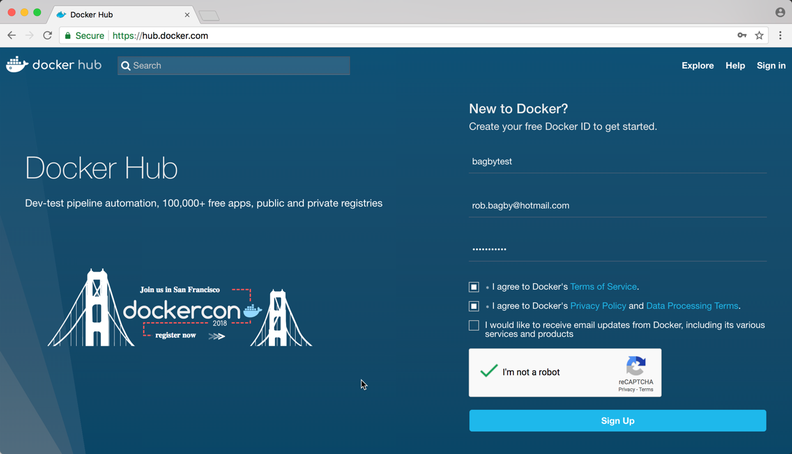

Figure X - Create a Docker ID

### Create a Docker Hub Repository

You are now able to login to https://hub.docker.com where you can create a Docker Hub repository:

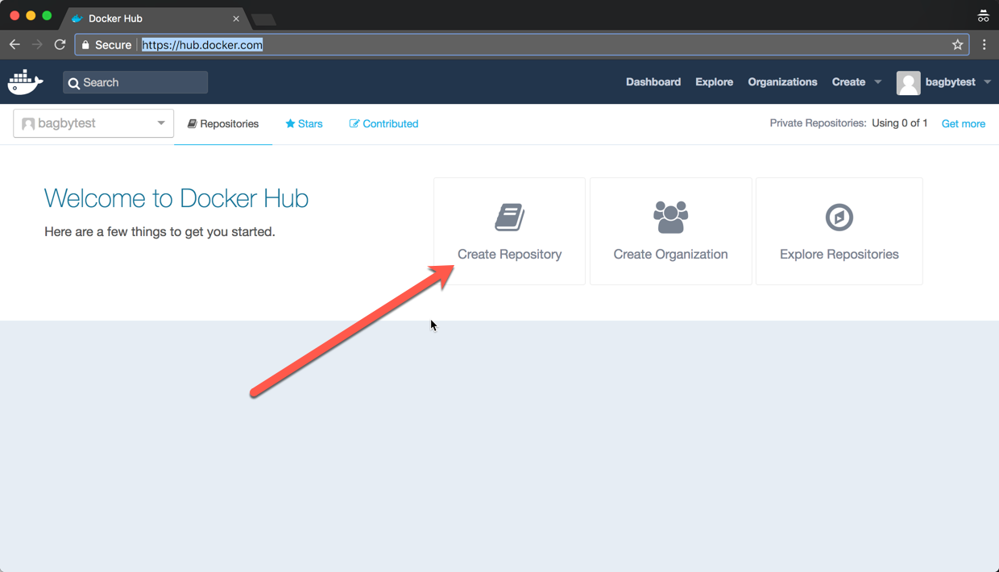

Figure X - Log In to Docker Hub


Figure X - Create a Docker Hub Repository

Creating a repository is quite simple.  You simply need to do the following:

1. Choose a namespace.  This can be the namespace of your Docker ID or the namespace of any Organization you are part of the Owners Group.  
2. Choose a name for your repository.  The name can contain only lowercase letters, numbers and '_' or '-'.  The character limit is 255.
3. Enter a short description.
4. Enter a description using markdown.
5. Choose if you want this repository public or private.  You can have 1 free private repository on Docker Hub.

For more information on creating a Docker Hub repository, please see the following link: https://docs.docker.com/docker-hub/repos/#creating-a-new-repository-on-docker-hub.

### Login to Docker Hub via CLI

You can now log in to Docker Hub at the command line.  Open the terminal of your choice and type in the following (Please note that you have to have the Docker CLI installed for this to work.  The CLI will be installed with Docker for Windows or Docker for Mac.):

``` sh
docker login
```

You will be queried for your username and password.  Enter the Docker ID and password you created earlier.

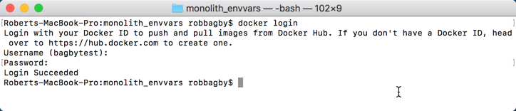

Figure X - Log In via CLI

You are now logged in to Docker Hub and ready to push an image.

### Understanding Image Names/Tags

In chapter 3, when discussing 'docker build', we introduced some of the image naming options.  It is also possible to create additional names/tags that reference the image.  The tags are very important as they provide the context for the image and its' variants.

Before getting into the naming/tagging options, we want to define 2 terms:
1) Registry - An image store or a place where you can push, store and pull images from.  Docker Hub is the default Docker image store.
2) Repository - A collection of related images.  Images belong to a repository and repositories belong to a registry.

As image names and tags are confusing, we thought we would attempt to clarify them, given the above terms.  There are 2 main components that identify an image (other than the id):
1) The image name - The name indicates which registry and repository the image belongs to.  It is a slash-separated name, optionally prefixed with a registry hostname.  If no hostname is provided, the default docker hostname is used.
2) The optional tag - The tag provides additional context to the name, usually indicating the major and minor version of the image.

Docker Hub enforces a 2-level hierarchy for image names: namespace/name.  Many private repos do not enforce this limitation.  The following figure shows some of the common naming/tagging options.

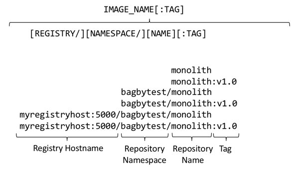

Figure X - Image Naming Options

| Segment | Notes |
|---|---|
|Registry Hostname|The optional registry hostname, plus optional port stipulates the registry that this image belongs to.  If it is omitted, the default registry of registry-1.docker.io is used.  As we will see later, if you are pushing your image to a registry other than the public docker registry, you must set that registry hostname here.|
|Namespace|This is the namespace of the registry to which this image belongs.  For example for bagbytest/monolith, this is bagbytest.|
|Name|This is the name portion of the repository.  For example for bagbytest/monolith, this is monolith|
|Tag|Tags are often used to indicate the major and minior version of the image.  If the tag is omitted, the tag 'latest' is used.|

TODO: Put a side note on what the latest tag means.

### Tagging the Image

As we saw in chapter 3, the '-t' option in 'docker build' allows you to specify a name and tag when building the image.

``` sh
docker build -t bagbytest/monolith:v1.0 .
```

The 'docker tag' command allows you to create a new name/tag that refers to a source image.

``` sh
docker tag SOURCE_IMAGE[:TAG] TARGET_IMAGE[:TAG]
```

Let's use our monolith as an example.  In chapter 3, we ran the following command:

``` sh
docker build -t monolith .
```

Here is what resulted:


Figure X - Docker Images

As you can see, we have 2 images locally: python:2.7-slim and monolith:latest.  The python image was pulled to your local repository when you ran docker build because the monolith image is based on it.  Again, because we did not specify a tag for the monolith, latest was defaulted.  You will also note that the monolith image had an id assigned: 02cfc8ee42df.

Now, suppose we want to push our image into our bagbytest/monolith repository in Docker Hub.  We need to run docker tag, providing a name with the namespace and name of our repository.  The following table describes our name:

| Segment | Value | Notes |
|---|---|---|
|Registry Hostname||Not required because we are pushing to Docker Hub|
|Namespace|bagbytest|Replace this with the namespace of your repository.|
|Name|monolith|The name of our repository|
|Tag|v1.0|Here we indicate that this is v1 of our monolith image|

``` sh
docker tag monolith bagbytest/monolith:v1.0
```

The following is the result of running the above command:

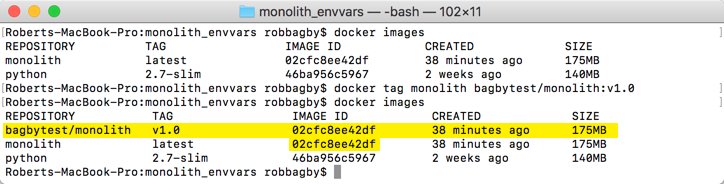

Figure X - Docker Tag

As you can see, we have associated our image with the bagbytest/monolith repository and given it the tag v1.0.  You will also note that this instance points at the same image.

### Pushing the Image

Because we have already created our Docker Hub account and authenticated, we can simply push our image by running the following command (replacing the repository name with yours):

``` sh
docker push bagbytest/monolith:v1.0
```

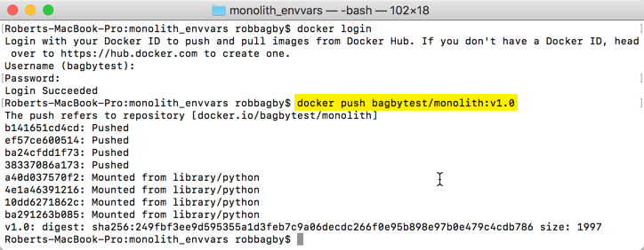

Figure X - Docker Push to Docker Hub

You can now see the image and the tag in Docker Hub

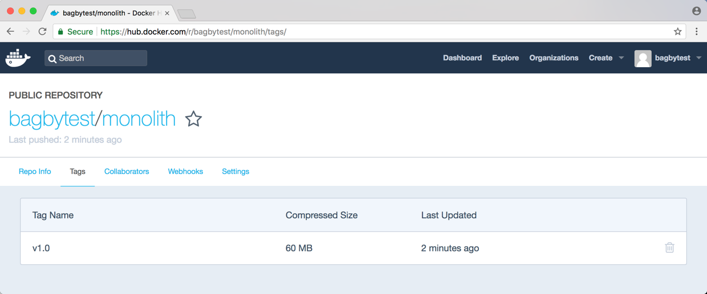

Figure X - bagbytest/monolith:v1.0 in Docker Hub

### Running the Image from Dockerhub Locally

We can test this locally by deleting our local images and running docker run.  Typing the following commands will remove all images in your local repository (Warning, *this will remove all mages in your local repository*:

``` sh
docker rmi -f $(docker images -q)
docker ps
```

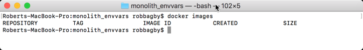

Figure X - No local images

``` sh
docker run -d --name monolith -p 9080:9080 \
	-e MYSQL_HOST=pk-monolith.mysql.database.azure.com \
	-e MYSQL_USERNAME=sqladmin@pk-monolith \
	-e MYSQL_PASSWORD=P@ssw0rd \
	-e INMEM_OR_MYSQL=INMEM \
     bagbytest/monolith:v1.0
```

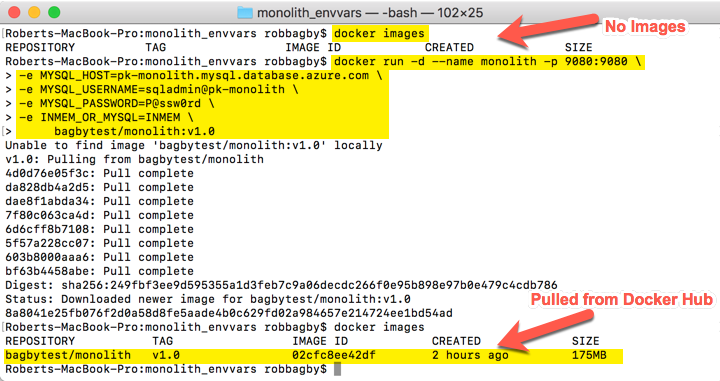

Figure X - docker run on image in Docker Hub

## Pushing to Azure Container Registry

In this section, we will create an Azure Container Registry and upload an image to it.

### Creating an Azure Container Registry with the Azure CLI

In order to follow along, you will need to have an Azure account and have the Azure CLI 2.0 installed.  You will find instructions on how to get a $200 free Azure account, as well as how to install the Azure CLI below:

* Get a free Azure account: https://azure.microsoft.com/en-us/free/
* Install the Azure CLI: https://docs.microsoft.com/en-us/cli/azure/install-azure-cli?view=azure-cli-latest

The first step is open a terminal session and log in.  You can find full details here: https://docs.microsoft.com/en-us/cli/azure/authenticate-azure-cli?view=azure-cli-latest.  We will log in interactively with a web browser

1. Run az login

```sh
az login
```

2. Open a browser and navigate to http://aka.ms/devicelogin and enter the code returned from the az login command

3. Log in with your credentials in the browser

Create a resource group.  All resources must be created in a resource group which acts as a logical container for resources.  We will create a resource group called productionkubernetesacr in east us.  The Azure Container Registry will be the only resource ever deployed to this resource group, so we gave it a name indicating that it contains a registry.

``` sh
az group create --name productionkubernetesacr --location eastus
```

Create an Azure Container Registry

``` sh
az acr create --resource-group productionkubernetesacr --name productionkubernetesacr --sku Basic
```

Authenticate to the registry

``` sh
az acr login --name productionkubernetesacr
```

### Tagging the Image for ACR

Just like we did for the Docker Hub, we need to tag our image for Azure Container Registry.  However, this time, we need to prepend the registry hostname.  You can get the hostname by running the following command:

``` sh
az acr list --resource-group productionkubernetesacr --query "[].{acrLoginServer:loginServer}" --output table
```

In my case, productionkubernetesacr.azurecr.io was returned.

Tag the image by running the following command:

``` sh
docker tag monolith productionkubernetesacr.azurecr.io/bagbytest/monolith:v1.0
```

The following is the result of us running the above commands:

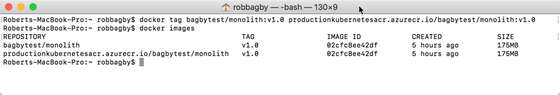

Figure X - Tagging the Image for ACR

### Pushing the Image to ACR

Now that we have authenticated to our Azure Container Registry and we have tagged the image with our registry hostname, we can simply issue a docker push:

``` sh
docker push productionkubernetesacr.azurecr.io/bagbytest/monolith:v1.0
```

The following are screenshots of my terminal, as well as the Azure Portal showing my image was uploaded:

[Push the Image to ACR](images/docker-push-acr.png)

Figure X - Pushing the Image to ACR

[Viewing the Image in the Azure Portal](images/azure-portal-acr.png)

Figure X - Viewing the Image in the Azure Portal

# Running the Monolith in Kubernetes

Our image is now in a private repository in Azure Container Registry in the East US.  One of the benefits of a private registry is the ability to create a close proximity between your cluster and your registry.  To that end, we will create an AKS (managed Kubernetes in Azure) cluster in East US and deploy our image there.


TODO: Discuss how we would athenticate from another cluster other than AKS...

## Creating an AKS Cluster

In this section, we will create an AKS cluster in EastUS.  For full details on creating an AKS cluster, see the online guidance here: https://docs.microsoft.com/en-us/azure/aks/tutorial-kubernetes-deploy-cluster.  

Create a resource group that will contain our AKS cluster.  The AKS cluster will have a different application lifecycle than our registry, so it naturally belongs in a different Resource Group.

``` sh
az group create --name productionkubernetesaks --location eastus
```

Create the AKS cluster

``` sh
az aks create --resource-group productionkubernetesaks --name productionkubernetesaks --node-count 2 --generate-ssh-keys
```

If you have not installed kubectl, run the following command:

``` sh
az aks install-cli
```

Get the credentials you will use to authenticate with the cluster

``` sh
az aks get-credentials --resource-group productionkubernetesaks --name productionkubernetesaks
```

We can now test our connectivity

``` sh
kubectl get nodes
```

## Configure Permissions Between AKS and ACR

We have pointed out several times that images in Azure Container Registry are not accessible publicly.  To that end, we need to give AKS the rights to pull images from our registry.  There are several ways to accomplish this.  A common approach in Azure is to use Azure Active Directory (AAD).

In AAD, you register applications that request access, as well as those authorizing access as Azure AD applications.  An application object is created.  This application object is the global representation of the application across all tenants.  In order to access resources that are protected by an Azure Active Directory tenant, the application requires something called a Service Principle which is a per-tenant representation of the application.  The Service Principle can then be assigned roles that give it authority to perform certain actions within the tenant.

In AKS, when you create a Service type LoadBalancer, AKS needs to create several Azure resources such as an Azure LoadBalancer and a Public IP.  In order to accomplish this, when you create an AKS cluster, the cluster is registered as an application in AAD and is given a Service Principle.  In order to give our cluster authority to pull from our registry, we need to do a role assignment to it's Service Principle.

Get the Service Principle id for our AKS cluster

``` sh
CLIENT_ID=$(az aks show --resource-group productionkubernetesaks --name productionkubernetesaks --query "servicePrincipalProfile.clientId" --output tsv)
```

Get the resource id for our ACR registry

``` sh
ACR_ID=$(az acr show --name productionkubernetesacr --resource-group productionkubernetesacr --query "id" --output tsv)
```

Grant our AKS Service Principle read rights on our ACR registry

``` sh
az role assignment create --assignee $CLIENT_ID --role Reader --scope $ACR_ID
```

## Deploying the image with kubectl run

Let's recap where we are:

* We have an ACR registry in the East US
* We have uploaded our monolith image to our ACR
* We have an AKS cluster in the East US
* We have granted our AKS cluster the rights to pull images from our ACS registry

The next step is to test all this out by running our image in our cluster.  kubectl has a run command that we can use to run our image.  Below you can see the command we ran and the result:

``` sh
kubectl run monolith --image=productionkubernetesacr.azurecr.io/bagbytest/monolith:v1.0 --port 9080 \
	--env MYSQL_HOST=pk-monolith.mysql.database.azure.com \
	--env MYSQL_USERNAME=sqladmin@pk-monolith \
	--env MYSQL_PASSWORD=P@ssw0rd \
	--env INMEM_OR_MYSQL=INMEM
```

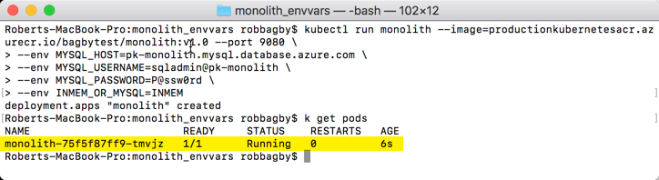

Figure X - Running our image in AKS

You can test the image by using the kubectl port-forward command to forward a local port to a pod.  The process is simple.

Get the id of the pod

``` sh
kubectl get pods
```

Forward the local port to the pod

``` sh
kubectl port-forward pod-name-from-above 9080:9080
```

Open a browser to http://localhost:9080

## Creating the Deployment Yaml

While kubectl run is a nice command for development, in practice, you create configuration files using a language called YAML.  Some of the benefits of this approach are:

* Many options are supported in the YAML configuration files that are not in the command line commands
* The config files can be stored in source control and versioned along with your application code
* It is arduous and error prone to enter all of the command line switches required

With all that said, often, the easiest way to create YAML files is to use command line commands.  Many kubectl commands support 2 command line options that, when used in conjunction, will help you create your YAML configuration files:
1) --dry-run=true: This will cause the command to only print the object that would be sent to the control plane
2) --output=yaml: This will print the output in YAML

To see this in action, let's add these 2 options to the kubectl run command we ran earlier and redirect the output to a file called monolith-deployment.yaml:

``` sh
kubectl run monolith --image=productionkubernetesacr.azurecr.io/bagbytest/monolith:v1.0 --port 9080 \
	--dry-run=true \
	--output=yaml \
	--env MYSQL_HOST=pk-monolith.mysql.database.azure.com \
	--env MYSQL_USERNAME=sqladmin@pk-monolith \
	--env MYSQL_PASSWORD=P@ssw0rd \
	--env INMEM_OR_MYSQL=INMEM \
	> monolith-deployment.yaml
```

Below is the yaml in the monolith-deployment.yaml config file.

``` yaml
apiVersion: extensions/v1beta1
kind: Deployment
metadata:
  creationTimestamp: null
  labels:
    run: monolith
  name: monolith
spec:
  replicas: 1
  selector:
    matchLabels:
      run: monolith
  strategy: {}
  template:
    metadata:
      creationTimestamp: null
      labels:
        run: monolith
    spec:
      containers:
      - env:
        - name: MYSQL_HOST
          value: pk-monolith.mysql.database.azure.com
        - name: MYSQL_USERNAME
          value: sqladmin@pk-monolith
        - name: MYSQL_PASSWORD
          value: P@ssw0rd
        - name: INMEM_OR_MYSQL
          value: INMEM
        image: productionkubernetesacr.azurecr.io/bagbytest/monolith:v1.0
        name: monolith
        ports:
        - containerPort: 9080
        resources: {}
status: {}
```

While this will likely not be your final config file, it does give you a great start.  You can deploy this config with the following command:

``` sh
kubectl create -f monolith-deployment.yaml
```

## Creating the Service Yaml

The kubectl expose command supports the --dry-run option, as well.  You can run the following command after you have created the deployment:

``` sh
kubectl expose deployment monolith --dry-run=true --output=yaml --type LoadBalancer --port=80 --target-port=9080 > monolith-service.yaml
``` 

Below is the yaml in the monolith-service.yaml config file.

``` yaml
apiVersion: v1
kind: Service
metadata:
  creationTimestamp: null
  labels:
    run: monolith
  name: monolith
spec:
  ports:
  - port: 80
    protocol: TCP
    targetPort: 9080
  selector:
    run: monolith
  type: LoadBalancer
status:
  loadBalancer: {}
```

To create the service, simply run the following command:

``` sh
kubectl create -f monolith-service.yaml
```

To see all this in action, get the public IP of your newly-created service and type that into a browser window.

``` sh
kubectl get services
```

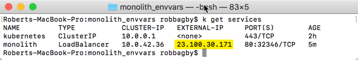
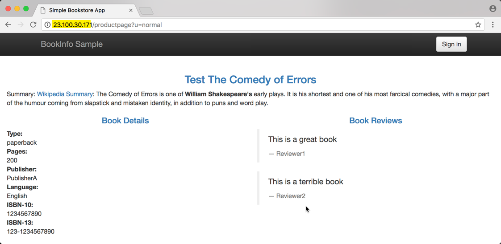

Figure X - Accessing Our Monolith

## Kubernetes Secrets

If you are like us, you likely have felt uncomfortable when you saw us passing sensitive information such as the MySQL hostname, username and password as environment, or worse yet stored in a deployment configuration.  The following are just a couple of challenges with this approach:

* Sensitive information stored directly in pod or deployment config files can be seen by any developers that require access to those files
* If the deployment config files are stored in source control, so are your secrets.  Read the following post that discusses this issue: https://news.ycombinator.com/item?id=13650818

To address these challenges, Kuberenetes created resources called Secrets.  Secrets are simply objects whose role is to store sensitive information.  The secret objects are then referenced by the pods.  In this section, we will illustrate the use of manually created secrets for storing our hostname, username and password.  Please note that there are other uses for secrets, such as automatically created secrets for Service Accounts and imagePullSecrets which provide another way to authenticate with private registries.  You can read the full secret documentation here: https://kubernetes.io/docs/concepts/configuration/secret/.

## Creating a Secret

Secrets contain Base64 encoded text.  You can create secrets either from a file, or from a secret config file.  We will illustrate both approaches, starting with from files.  Assume we have 3 files:

``` sh
echo 'pk-monolith.mysql.database.azure.com' > ./hostname.txt
echo 'sqladmin@pk-monolith' > ./username.txt
echo 'P@ssw0rd' > ./password.txt
```

We can issue the following command to create our secret:

``` sh
kubectl create secret generic mysql-dev --from-file=./hostname.txt --from-file=./username.txt --from-file=./password.txt
```

You can view the secret:

``` sh
$ kubectl describe secrets/mysql-dev
Name:         mysql-dev
Namespace:    default
Labels:       <none>
Annotations:  <none>

Type:  Opaque

Data
====
hostname.txt:  37 bytes
password.txt:  9 bytes
username.txt:  21 bytes
```

We could have also created the secret with a config file:

``` sh
$ echo 'pk-monolith.mysql.database.azure.com' | base64
cGstbW9ub2xpdGgubXlzcWwuZGF0YWJhc2UuYXp1cmUuY29tCg==
$ echo 'sqladmin@pk-monolith' | base64
c3FsYWRtaW5AcGstbW9ub2xpdGgK
$ echo 'P@ssw0rd' | base64
UEBzc3cwcmQK
```

We now use those encoded values in a secret config YAML file.  We created a file called mysql-dev-secret.yml:

``` yaml
apiVersion: v1
kind: Secret
metadata:
  name: mysql-dev-from-config
type: Opaque
data:
  hostname: cGstbW9ub2xpdGgubXlzcWwuZGF0YWJhc2UuYXp1cmUuY29tCg==
  username: c3FsYWRtaW5AcGstbW9ub2xpdGgK
  password: UEBzc3cwcmQK
```

We then use kubectl create to create the secret:

``` sh
$ kubectl create -f mysql-dev-secret.yml
secret "mysql-dev-from-config" created
$ kubectl describe secrets/mysql-dev-from-config
Name:         mysql-dev-from-config
Namespace:    default
Labels:       <none>
Annotations:  <none>

Type:  Opaque

Data
====
username:  21 bytes
hostname:  37 bytes
password:  9 bytes
```

## Consuming the Secret

There are a couple of options for consuming the secret: 1) Mounting the secret as a volume and using the secret as a file and 2) Using the secret as an environment variable.  We will illustrate the latter here, as we have already updated our monolith to consume environment variables.

Update the deployment yaml file:

``` yaml
apiVersion: extensions/v1beta1
kind: Deployment
metadata:
  creationTimestamp: null
  labels:
    run: monolith
  name: monolith
spec:
  replicas: 1
  selector:
    matchLabels:
      run: monolith
  strategy: {}
  template:
    metadata:
      creationTimestamp: null
      labels:
        run: monolith
    spec:
      containers:
      - env:
        - name: MYSQL_HOST
          valueFrom:
            secretKeyRef:
              name: mysql-dev-from-config
              key: hostname
        - name: MYSQL_USERNAME
          valueFrom:
            secretKeyRef:
              name: mysql-dev-from-config
              key: username
        - name: MYSQL_PASSWORD
          valueFrom:
            secretKeyRef:
              name: mysql-dev-from-config
              key: password
        - name: INMEM_OR_MYSQL
          value: MYSQL
        image: productionkubernetesacr.azurecr.io/bagbytest/monolith:v1.0
        name: monolith
        ports:
        - containerPort: 9080
        resources: {}
status: {}
```

You can then update your deployment or delete it and re-create.  In order to clearly illustrate that the deployment is using our secret, we will delete and re-create our deployment.  We saved the new configuration in a file called monolith-deployment-secret.yml.

``` sh
$ kubectl delete deployment monolith
deployment.extensions "monolith" deleted
$ kubectl create -f monolith-deployment-secret.yml 
deployment.extensions "monolith" created
```

***Where I left off
Need to add debugging in the monolith to write the error when trying to access database.  Right now, I have the monolity without the secrets and not retrieving data
I have added firewall rules for the PIP, as well as allowed access from Azure services.


## Secrets Aren't Really Secret


## Namespaces

